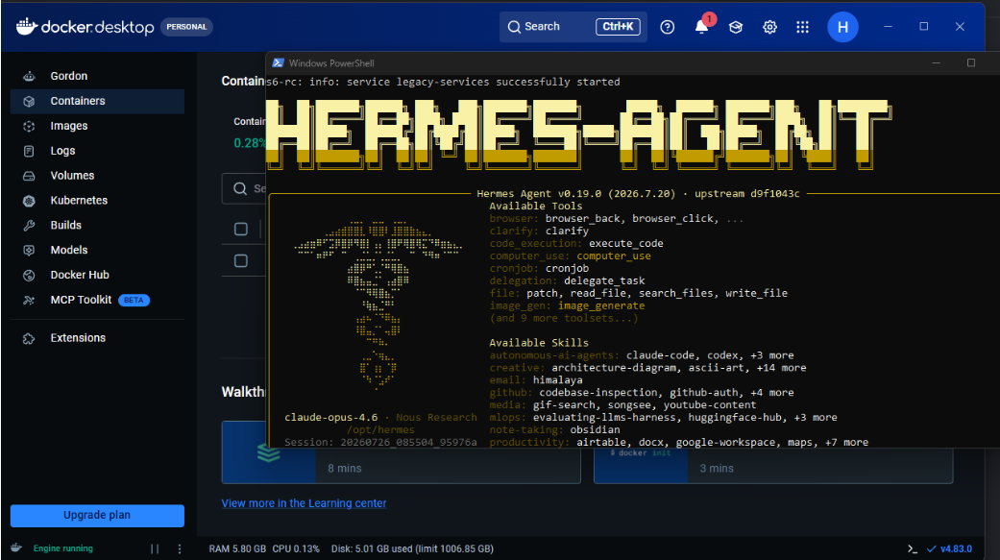
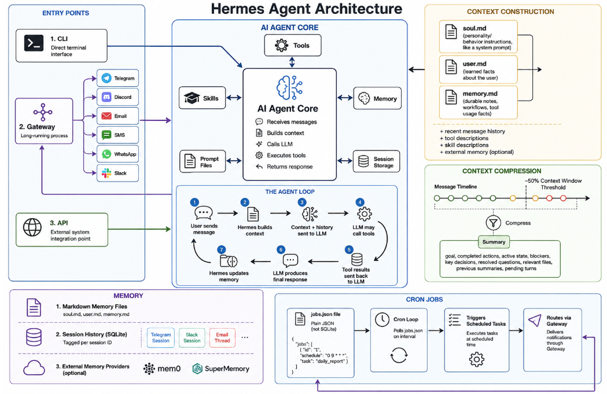
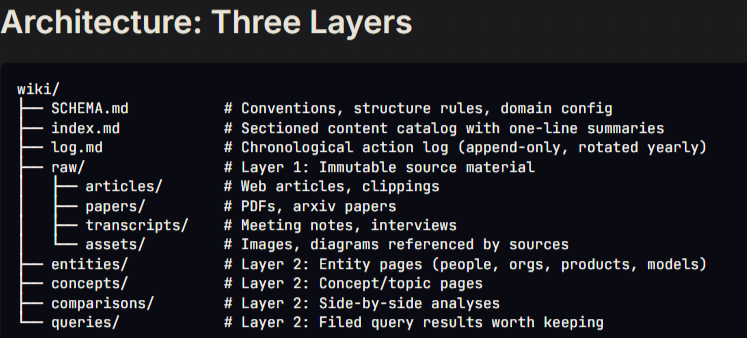
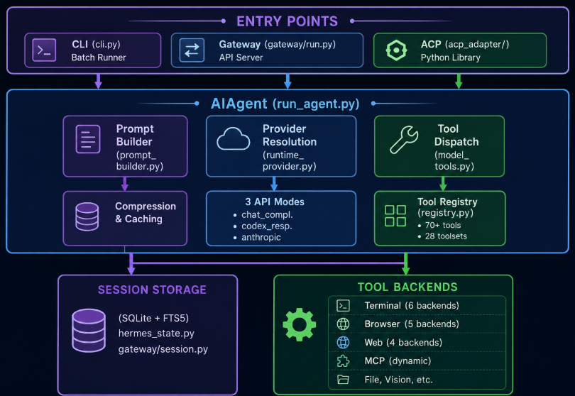
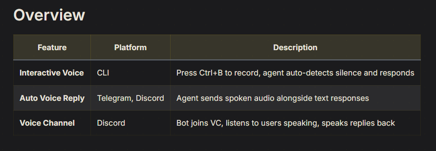

# Local AI with Gemma by Google (Nara)

<div align="center">
  
  <br />
  <strong>350 Hr — Local AI with Gemma by Google</strong>
  <br />
  <em>GSoC 2026 · Liquid Galaxy Lab · Project Documentation</em>
</div>

---

**Nara** is the onboard AI assistant for Liquid Galaxy. Built on the [Hermes Agent](https://hermes-agent.nousresearch.com/docs/) framework, it runs on a local machine (Raspberry Pi recommended), controls the LG rig over SSH, and generates KML visualizations, guided tours, and live data layers — fully local or hybrid cloud inference.

| | |
| :--- | :--- |
| **Project** | Nara — onboard AI for Liquid Galaxy |
| **Framework** | [Hermes Agent](https://hermes-agent.nousresearch.com/) (Nous Research) |
| **Contributors** | Harsh Mehta (mentee) |
| **Mentors** | Andreu Ibanez, Moises Martinez |
| **Backup / profiles** | [Google Drive folder](https://drive.google.com/drive/folders/1mQyJYMV7bvj-cq7geYF7AcXGROvqjj-z) |

### How to use this documentation

This documentation covers important concepts, how the project works, how a user can replicate it, GSoC progress, and key references. It is intended for contributors, mentors, and users who want to learn how the system works, deploy it on their own hardware, or build new capabilities on top of it.

The guide starts with goals and architecture, then walks through installation, configuration, and profile restoration before covering modular skills, practical use cases, and development experience. Whether you are using Nara on a Raspberry Pi with a Liquid Galaxy rig, experimenting with Hermes, or contributing new features, following the documentation in order provides the background, setup steps, and references you need.

**Want to start right away?** Jump to [Installation](#installation).

---

## Table of Contents

1. [About Me & Acknowledgements](#about-me--acknowledgements)
2. [About the Project](#about-the-project)
3. [Skill Architecture Design](#skill-architecture-design)
4. [Planned Tasks](#planned-tasks)
5. [What Nara Can Do](#what-nara-can-do)
6. [Example Use Cases (What can you do with current version of project)](#example-use-cases-what-can-you-do-with-current-version-of-project)
7. [Quick Start](#quick-start)
8. [Hermes Agent Setup](#hermes-agent-setup)
9. [Installation](#installation)
10. [Restoring the Liquid Galaxy Profile](#restoring-the-liquid-galaxy-profile)
11. [Docker & WSL Setup](#docker--wsl-setup)
12. [SOUL.md (Nara personality)](#soulmd-nara-personality)
13. [Hermes Agent Architecture](#hermes-agent-architecture)
14. [LLM Wiki & Google OKF](#llm-wiki--google-okf)
15. [System Architecture](#system-architecture)
16. [Tech Stack](#tech-stack)
17. [Hardware](#hardware)
18. [Hardware Setup](#hardware-setup)
19. [Example Usage](#example-usage)
20. [Voice Support](#voice-support)
21. [GitHub Access for the Agent](#github-access-for-the-agent)
22. [Current Status](#current-status)
23. [Experiences During Development](#experiences-during-development)
24. [References](#references)

---

## About Me & Acknowledgements

I'm **Harsh Mehta**, a curious engineering student from Pune with a keen interest in how real-world production systems work. Grateful to Liquid Galaxy and Google Summer of Code for this opportunity to learn and to ship work that others can actually use in the lab.

Many thanks to **Trang, Fabricio, Oriol, and Josep** at the Liquid Galaxy Lab in Lleida for testing and sharing valuable feedback on the project.

---

## About the Project

This project builds **Nara** — an AI assistant server that lives on the Liquid Galaxy rig's local network. Nara runs on a Raspberry Pi 5 connected to the rig via SSH, accepts commands through the CLI (and optionally messaging gateways), and autonomously generates and pushes content such as KML visualizations, guided tours, real-time data maps, and more directly to the Liquid Galaxy screens.

The system is built as a Hermes agent with a **modular skill architecture**, meaning capabilities can be added, enabled, or disabled independently without touching the core runtime. It supports both fully local AI inference (offline, self-contained) and a hybrid mode that optionally routes complex tasks to remote model APIs — balancing hardware limits with response quality.

The goal is a stable, easy-to-extend assistant that any LG user, mentor, or contributor can run in the lab or deploy from a backup profile.

---

## Skill Architecture Design

The project follows a standardized, modular skill architecture to make Liquid Galaxy capabilities easy to develop, maintain, and extend. Rather than embedding logic directly into the agent, each capability is implemented as an independent skill with a single responsibility, allowing new features to be added without modifying the core runtime.

The architecture is organized into **six logical layers**:

| Layer | Role |
| :--- | :--- |
| **User Layer** | Accepts requests from the CLI, Web UI, voice interface, Telegram, or scheduled jobs |
| **Hermes Runtime** | Acts as the central orchestrator, selecting the appropriate skills, managing conversations, and maintaining long-term memory |
| **Skill Layer** | Contains independent, reusable skills such as LG SSH Control and KML Generation, with support for future plug-in skills |
| **Knowledge Layer** | Stores shared templates, scripts, documentation, references, troubleshooting guides, and best practices that can be reused across multiple skills instead of duplicating information in prompts |
| **Learning Layer** | Captures reusable workflows, successful procedures, and troubleshooting knowledge to continuously improve the agent over time |
| **Deployment Layer** | Provides a common deployment mechanism for all skills, enabling KML uploads, SSH command execution, visualization updates, and Liquid Galaxy administration through the master node |

### Skill consistency

To ensure consistency, every skill follows the same directory structure and documentation format, including metadata, trigger conditions, procedures, verification steps, references, templates, scripts, and examples. Skills remain self-contained, while shared utilities are placed in common directories for reuse.

In this repository that maps to:

```text
skills/
├── <skill-name>.md              # Skill doc (metadata, procedures, examples)
├── references/<skill-name>/     # Shared troubleshooting & architecture notes
├── scripts/<skill-name>/        # Deployable helpers / generators
└── templates/<skill-name>/      # Reusable KML / config templates
```

Full catalog: [SKILLS.md](SKILLS.md).

### Workflow for new functionality

A standard workflow is followed when introducing new functionality:

1. **Determine** whether the request extends an existing skill or requires a new one.  
2. **Create** the skill using the standard template.  
3. **Register** the skill so Hermes can discover it automatically.  
4. **Validate** the complete workflow through real execution on the Liquid Galaxy rig.  
5. **Preserve** reusable knowledge through Hermes' learning system and update the associated documentation.

### Learning strategy

The learning strategy distinguishes between three types of knowledge:

| Type | Where it lives | Purpose |
| :--- | :--- | :--- |
| **Durable facts** | Persistent memory | Stable facts stored for reuse (IPs, rig constraints, preferences) |
| **Procedural knowledge** | Reusable skills and workflows | How to perform tasks correctly across sessions |
| **Session history** | Conversational / SQLite history | Context and debugging within a conversation |

This standardized architecture makes the project scalable, encourages community contributions, minimizes duplicated logic, and enables new Liquid Galaxy use cases to be added with minimal changes to the existing system.

---

## Planned Tasks

| # | Task | Result |
| :-: | :--- | :--- |
| 1 | Work on docs | ✅ Done |
| 2 | Test Docker and WSL-based setups | ✅ WSL and Docker setup works |
| 3 | Test architecture & advanced use cases (not only single-API demos) | Architecture works well; virtual LG setup use case; ≥2 data sources |
| 4 | Build a virtual LG | Added to GitHub and docs |
| 5 | PPT for 13 Aug | 🔄 Ongoing |
| 6 | 27 Jul — update docs | ✅ Done |

Full skill catalog: **[SKILLS.md](SKILLS.md)** · every skill is a flat file under [`skills/<name>.md`](skills/).

---

## What Nara Can Do

- Control the Liquid Galaxy rig over SSH (relaunch, reboot, shutdown, clear KMLs)
- Generate and deploy KMLs for placemarks, overlays, tours, and camera paths
- Visualize live or historic data layers (weather, aviation, disasters, maritime, energy)
- Provide educator-focused flows (geography, history) with narrated tours
- Backup & restore a complete Hermes profile for quick deployment

### Use cases — planned order

- **LG command execution** — SSH control (relaunch, reboot, poweroff)
- **Weather monitoring** — fetch live weather and visualize via KML
- **News & geopolitical visualization** — live event mapping on LG
- **Geography educator** — teach geography concepts with real-world examples and KMLs
- **History educator** — show how historical events (e.g. wars) unfolded
- **Natural disaster command center** — earthquakes, wildfires, weather alerts, climate anomalies, displacement flows
- **Maritime domain awareness** — AIS density, trade routes, chokepoints, live tankers, cable advisories
- **Energy & infrastructure** — pipelines, energy infrastructure, fuel shortages, renewables, mining
- **Live aviation watch** — military flights, delays, NOTAM rings, airport status
- **Cyber / undersea infrastructure** — undersea cables, internet outages, GPS jamming, cyber threats
- **Supply chain & trade flows** — trade routes, chokepoints, commodity ports, tanker positions
- **Economic markets** — Finnhub and FRED for financial trends, equities, and indicators
- **Armed conflicts** — ACLED and UCDP for political violence and warfare mapping
- **Animal migrations** — Movebank / IUCN wildlife tracks and seasonal corridors
- **Coral reef monitor** — NOAA bleaching alerts and reef health layers
- **Country instability index** — cross-stream stress scores from multiple domain skills
- **Prediction markets (geo)** — Polymarket geopolitics mapped to country centroids
- **Global progress dashboard** — positive trend maps (poverty, health, renewables)
- **Deforestation monitor** — FIRMS fires, tree-cover loss, biodiversity hotspots
- **Satellite orbital tracker** — CelesTrak / SGP4 ISS, Starlink, and debris shells

---

## Example Use Cases (What can you do with current version of project)

| Skill name | Input Examples | Prompt [added to input] | How it works | Expected Output | Link to SKILL.md |
| ----- | ----- | ----- | ----- | ----- | ----- |
| lg-ssh-control✅ | "Hey Nara, connect to the Liquid Galaxy and confirm everything is reachable"; "The rig froze mid-tour. Can you reboot it carefully and tell me when Earth is back?"; "We are done for the day. Clear every map that is loaded, then power the whole rig down." | User command plus saved rig connection details (address, login, number of screens) | Connects to the main Liquid Galaxy machine over the local network, then runs the control action you asked for. It can relaunch Earth, reboot or shut down the rig, clear loaded maps, or refresh the display, and it reports what it did. | A clear confirmation of each step (connected, relaunched, rebooted, cleared, or powered off) and the screens update to match | https://github.com/LiquidGalaxyLAB/local-ai-gemma/blob/main/skills/lg-ssh-control.md |
| lg-use-cases✅ | "I am new here. What can this assistant actually do on the Liquid Galaxy?"; "Walk me through every demo I could show visitors this weekend, and say which ones need internet"; "Give me a quick capability tour so I know what is ready for a lab open day." | User question about what Nara supports, offline vs online demos, and good showcases | Acts like a friendly guided manual. It lists the main use cases, explains what each one shows on the screens, and helps you pick a good demo order for students or visitors. | A spoken or written tour of available demos, what each needs to run, and simple suggestions for what to show next | https://github.com/LiquidGalaxyLAB/local-ai-gemma/blob/main/skills/lg-use-cases.md |
| geography-educator✅ | "Teach me about the International Date Line and draw it on the rig so the class can see it"; "Show India monsoon patterns on the Liquid Galaxy and explain them simply"; "Explain the Turkey earthquake zone, mark the fault areas, and narrate a short lesson." | Geography topic or place plus simple teaching goal | Turns a geography question into a short lesson on the globe. It draws regions, lines, and labels that match the topic, flies the camera to useful viewpoints, and can read a plain-language explanation out loud. | Educational map layers on the screens, a short guided fly-through, a right-screen lesson panel, and optional voice narration | https://github.com/LiquidGalaxyLAB/local-ai-gemma/blob/main/skills/geography-educator.md |
| armed-conflicts✅ | "Show me the global conflicts you are tracking right now and how serious they look"; "Where are the active wars today? Put them on the rig and give me a guided tour with narration"; "Brief me on the main conflict zones, then zoom into each one and explain what the map symbols mean." | Conflict briefing request plus region focus if the user names one | Builds a conflict awareness map for major zones around the world. Each area gets clear visual cues for fronts, pressure, and movement, then the camera tours the set while a short narration explains what you are seeing. | Conflict zones marked on the globe, a multi-stop guided tour, spoken summaries per region, and a right-screen briefing panel | https://github.com/LiquidGalaxyLAB/local-ai-gemma/blob/main/skills/armed-conflicts.md |
| weather-monitor✅ | "What is the weather like in Pune right now? Put temperature and wind on the rig"; "Show Mumbai weather in 3D and tell me if it is a good day to be outside"; "Compare Madrid and Barcelona weather for tomorrow and highlight the clearer city." | City or region plus what weather details the user cares about | Looks up live weather for the place you name, then draws simple temperature and wind cues on the globe. It can summarize conditions in everyday language and optional speech. | Weather markers and columns over the city, a short spoken or written summary, and a right-screen weather panel | https://github.com/LiquidGalaxyLAB/local-ai-gemma/blob/main/skills/weather-monitor.md |
| natural-disaster✅ | "Show earthquakes in Japan right now and fly me to the strongest ones"; "Any wildfires in Spain I should know about? Put alerts on the Liquid Galaxy"; "Give me a disaster watch for Southern Europe: quakes, fires, and weather alerts, then narrate the highlights." | Region plus disaster types the user wants to watch | Pulls recent disaster alerts for the area you choose, places them on the map, and auto-flies to the most important events. A short summary counts what was found and what looks most urgent. | Event markers on the globe, a camera path to key incidents, a count of what was found, and a right-screen alert summary | https://github.com/LiquidGalaxyLAB/local-ai-gemma/blob/main/skills/natural-disaster.md |
| live-aviation✅ | "Show all flights currently over Germany and label the busy airports"; "What does air traffic over Europe look like right now? Give me a live watch on the rig"; "Focus on major airports near me, show nearby aircraft, and explain the densest corridors." | Region or airport focus plus live air-traffic request | Reads live aircraft positions for the area you choose and places planes on the globe with direction and height cues. Major airports can appear as anchors so you can read traffic density at a glance. | Live plane markers over the region, airport labels, a short traffic summary, and a right-screen activity panel | https://github.com/LiquidGalaxyLAB/local-ai-gemma/blob/main/skills/live-aviation.md |
| history-educator✅ | "Tell me about World War II as a visual story on the Liquid Galaxy"; "Teach the rise of the Roman Empire with maps and a short narration"; "Show how the partition of India unfolded, step by step, for a classroom demo." | Historical topic, place, or time period plus teaching goal | Turns history into a phased map story. Territories, movements, and key places appear in order, the camera follows the narrative, and optional voice explains each stage in plain language. | Timeline-style map layers, a multi-step fly-through, a lesson-style right-screen panel, and optional narration | https://github.com/LiquidGalaxyLAB/local-ai-gemma/blob/main/skills/history-educator.md |
| maritime-awareness✅ | "Show undersea cables arriving in India and explain why they matter"; "Put live tankers in the Red Sea on the rig and highlight chokepoints"; "Visualize major trade routes near Europe, then zoom into the busiest sea lanes." | Sea region or theme (cables, ships, trade routes) | Maps the ocean picture you asked for: cables, vessels, routes, or warnings. Different colors keep each layer easy to read, and the right screen explains the scene without jargon. | Colored sea routes and markers on the globe, optional live ship positions, a short maritime brief, and a right-screen info panel | https://github.com/LiquidGalaxyLAB/local-ai-gemma/blob/main/skills/maritime-awareness.md |
| energy-monitor✅ | "Where are major oil fields near Russia, and can you show pipelines too?"; "Any fuel shortage pressure right now that I should visualize for a briefing?"; "Show renewable energy sites in the Middle East and highlight the biggest solar areas." | Energy theme and region (oil, gas, shortages, renewables) | Gathers energy-related public data for the area you name and draws a multi-layer energy picture: resources, infrastructure, stress, or clean-energy sites. The map can refresh while the rig keeps running. | Energy layers on the globe, a short status summary, and a right-screen energy dashboard visitors can follow | https://github.com/LiquidGalaxyLAB/local-ai-gemma/blob/main/skills/energy-monitor.md |
| cyber-infrastructure✅ | "Is there GPS jamming anywhere right now? Show hotspots on the globe"; "Are there major internet disruptions or routing incidents today I should put on the rig?"; "Map undersea-internet and connectivity stress, then walk me through the worst areas." | Cyber or connectivity theme plus region if given | Collects public signals about connectivity problems such as jamming, outages, or routing trouble, then paints those problem areas on the map so a non-expert can see where the network is under stress. | Problem zones and links marked on the globe, a short plain-language briefing, and a dark right-screen status panel | https://github.com/LiquidGalaxyLAB/local-ai-gemma/blob/main/skills/cyber-infrastructure.md |
| economic-markets✅ | "How are markets in India looking today? Show the big picture on the rig"; "Map global inflation pressure and tell me which regions stand out"; "Which economies look weakest right now, and can you visualize the comparison for a class?" | Market or economy question plus region or theme | Turns market and economy indicators into a simple globe view. Regions light up or rise based on the numbers that matter for your question, and the right screen keeps the takeaway short. | Region-colored market map, a short comparison summary, and a right-screen panel with a few clear economic points | https://github.com/LiquidGalaxyLAB/local-ai-gemma/blob/main/skills/economic-markets.md |
| animal-migrations✅ | "Show the monarch butterfly migration on the rig and explain the season"; "Track the wildebeest migration and fly along the main corridors"; "Where do humpback whales travel? Put the routes on the Liquid Galaxy for a nature demo." | Species or migration story plus season or region if known | Loads known wildlife migration paths, checks whether the season makes sense for that animal, and draws colored corridors with direction so viewers can follow the journey across continents or oceans. | Migration paths on the globe, seasonal context on the right screen, and a short nature-style tour of the main routes | https://github.com/LiquidGalaxyLAB/local-ai-gemma/blob/main/skills/animal-migrations.md |
| coral-reef-monitor✅ | "Show coral bleaching risk on the rig, starting with the Great Barrier Reef"; "What is the state of major reefs near North America right now?"; "Give me a global reef-health tour and explain which areas are under the most heat stress." | Reef region or global reef-health request | Maps reef areas and how stressed they look from public bleaching and reef-health signals. Color makes mild stress easy to tell apart from severe stress, and the camera can tour the most important reefs. | Reef outlines and alert colors on the globe, a guided reef tour, and a right-screen health summary in simple language | https://github.com/LiquidGalaxyLAB/local-ai-gemma/blob/main/skills/coral-reef-monitor.md |
| country-instability-index🆕 | "Put the country instability index on the rig and walk me through the hottest spots"; "Which countries look most unstable right now, and can you explain why?"; "I am giving a briefing later. Show a global stress map and then zoom into the top five countries that need attention." | User request plus the instability skill and related signals from conflict, markets, cyber, and disaster views | Combines several live picture streams into one simple stress score per country. Taller columns mean more pressure. The camera slowly tours the globe so you can see calm regions next to crisis regions, then focuses on the places that rank highest. | A world view with columns rising from countries, a short guided tour of the riskiest areas, and a right-screen summary that explains each country’s main drivers in plain language | https://github.com/LiquidGalaxyLAB/local-ai-gemma/blob/main/skills/country-instability-index.md |
| prediction-markets-geo🆕 | "What are prediction markets saying about elections and conflicts right now? Show it on the globe"; "Map Polymarket odds for the big geopolitical questions and fly me between the high-stakes places"; "Where is the world’s money betting things will go wrong, and where do people mostly agree?" | User topic or region plus public prediction-market odds for politics, conflict, sanctions, and similar events | Reads open betting markets and places each question on the map near the country it is about. Rings grow or pulse where odds are uncertain. Places where traders mostly agree look calmer. The camera moves between the markets that matter most. | Colored rings on the globe for each market, a fly-through of the most interesting bets, and a right-screen panel that states the question, the current odds, and a short plain-language takeaway | https://github.com/LiquidGalaxyLAB/local-ai-gemma/blob/main/skills/prediction-markets-geo.md |
| global-progress-dashboard🆕 | "Show something positive on the rig for a classroom visit. What is actually getting better in the world?"; "Map global progress on poverty, child health, and clean energy, then narrate a short tour"; "I need an uplifting demo for visitors. Highlight regions that improved the most and explain why it matters." | User demo goal plus open public data on poverty, health, energy, life expectancy, and disease progress | Pulls well-known global improvement stats and turns them into a hopeful map for classrooms and public demos. Instead of only crisis news, it shows trends that are getting better, with warm colors and a friendly guided tour. | A bright progress map on the screens, columns or regions that show gains over time, a short narrated tour, and a right-screen panel with a few clear facts visitors can remember | https://github.com/LiquidGalaxyLAB/local-ai-gemma/blob/main/skills/global-progress-dashboard.md |
| deforestation-monitor🆕 | "Show live deforestation and forest fires on the rig, starting with the Amazon"; "Where are forests being lost right now, and which protected areas are under pressure?"; "Give me a forest-watch tour: fires, tree loss, wildlife hotspots, and places that are still protected." | User region or theme plus forest-fire alerts, tree-loss trends, wildlife hotspot maps, and protected-area outlines | Watches forests from a few simple layers at once: where fires are active, where tree cover has been falling, which places are rich in wildlife, and which land is marked as protected. The camera flies major front lines so you can compare regions side by side. | Fire markers and forest-loss coloring on the globe, outlines for important habitats and parks, a tour of major deforestation fronts, and a right-screen brief on what you are seeing | https://github.com/LiquidGalaxyLAB/local-ai-gemma/blob/main/skills/deforestation-monitor.md |
| satellite-orbital-tracker🆕 | "Show the International Space Station on the rig and follow its path"; "Put a satellite tracker on the LG with Starlink and a few famous missions, and explain what I am looking at"; "Where is Hubble right now, and can you rise the camera through the main layers of orbit so visitors understand height?" | User target (ISS, Hubble, Starlink, or general tracker) plus public orbit catalogs | Places real satellites and stations around a 3D Earth at roughly the height they actually fly. You can follow the ISS, see dense internet constellations, and compare low orbits with much higher navigation shells. The camera can rise step by step so height becomes easy to understand. | Moving markers and paths around the globe, a climb through different orbit heights, labels for well-known objects, and a right-screen mission-style panel that names what is on screen | https://github.com/LiquidGalaxyLAB/local-ai-gemma/blob/main/skills/satellite-orbital-tracker.md |

### Liquid Galaxy setup helper

This skill helps users build a **virtual Liquid Galaxy** rig on their own machine.

| | |
| :--- | :--- |
| **Skill** | [`lg-installation-setup`](https://github.com/LiquidGalaxyLAB/local-ai-gemma/blob/main/skills/lg-installation-setup.md) |
| **What it is** | Step-by-step guide and automated helper for a multi-screen Liquid Galaxy VM rig (e.g. three Ubuntu VMs) |
| **Covers** | VM networking, frame assignment, SSH setup, and basic repairs |

**Example prompts**

- "Help me set up a 3-screen Liquid Galaxy rig using VirtualBox on Ubuntu 16.04."
- "I just created three blank VMs (lg1, lg2, lg3) for Liquid Galaxy. How do I configure the network adapters and SSH access?"

### How the skills relate

The system is layered so features reuse core capabilities instead of duplicating work:

| Core skill | Role |
| :--- | :--- |
| `lg-ssh-control` | Rig communication (SSH, relaunch, reboot, clear) |
| `lg-kml-tours` | Visualization primitives and camera tours |
| `lg-data-visualization` | Normalizes live data feeds for other skills |

Each domain has its own specialized skill and visual style — news storytelling, history education, armed conflicts, maritime awareness, energy monitoring, cyber infrastructure, economic markets, aviation, wildlife migrations, coral reef monitoring, orbital tracking, and more — while sharing the same deployment framework.

Skills also compose with each other:

- **`country-instability-index`** — meta-skill compositing signals from armed-conflicts, economic-markets, cyber-infrastructure, and natural-disaster into one cross-stream view
- **`global-progress-dashboard`** — deliberate counterweight with warm, optimistic classroom-friendly visuals
- **`prediction-markets-geo`** — geo-forecast layer for what aggregate markets believe will happen next
- **`deforestation-monitor`** / **`satellite-orbital-tracker`** — open ecosystem-scale and orbital domains

All visualizations follow the same deploy path, can update on the Liquid Galaxy without a full relaunch, and use a consistent right-screen dashboard layout.

**Skill count:** **30** skill files under [`skills/`](skills/) (domain demos plus infrastructure helpers). Full catalog: [SKILLS.md](SKILLS.md).

---

## Quick Start

1. Install Hermes Agent ([Installation](#installation)).
2. Ensure SSH connectivity between the Pi (or host) and the Liquid Galaxy master node.
3. Import or restore the `liquid-galaxy-agent` Hermes profile ([backup folder](https://drive.google.com/drive/folders/1mQyJYMV7bvj-cq7geYF7AcXGROvqjj-z)).
4. Enable skills (`lg-ssh-control`, weather, geography, etc.) and configure API keys with `hermes model`.

---

## Hermes Agent Setup

The self-improving AI agent built by Nous Research. It has a built-in learning loop: it creates skills from experience, improves them during use, persists knowledge, and builds a model of who you are across sessions.

**Website:** [https://hermes-agent.nousresearch.com/](https://hermes-agent.nousresearch.com/)

### Profiles

A [profile](https://hermes-agent.nousresearch.com/docs/user-guide/profiles) is a self-contained Hermes home directory. This project starts with one profile: **`liquid-galaxy-agent`**.

Each profile gets its own `config.yaml`, `.env`, `SOUL.md`, memories, sessions, skills, cron jobs, and state database — independent directories, a clean slate.

### Backups

[Backups](https://hermes-agent.nousresearch.com/docs/getting-started/updating#full-pre-update-backup---backup) create a zip archive of config, skills, sessions, and data (everything except the codebase). Restore with [`hermes import`](https://hermes-agent.nousresearch.com/docs/reference/cli-commands#hermes-import).

| Mode | Role |
| :--- | :--- |
| **CLI session** | Interactive terminal UI — conversation loop, system prompts, model providers, tools, history |
| **Gateway message** | 20+ messaging adapters (Discord, Slack, WhatsApp, etc.) — auth, session isolation, routing |

### Skills setup

Hermes needs custom skills for LG-specific use cases. A skill = instructions + shell commands + tools. Skills and tools work together to satisfy use cases.

- [Adding Tools](https://hermes-agent.nousresearch.com/docs/developer-guide/adding-tools)
- [Creating Skills](https://hermes-agent.nousresearch.com/docs/developer-guide/creating-skills)

Skills live under the profile directory, e.g. `~/.hermes/profiles/<profile>/skills/` (each profile has its own skills tree).

In **this repo**, every skill is a **flat markdown file**:

| Path | Role |
| :--- | :--- |
| [`skills/<name>.md`](skills/) | Skill document (YAML frontmatter + procedures) |
| [`skills/references/<name>/`](skills/references/) | Optional architecture notes & troubleshooting |
| [`skills/scripts/<name>/`](skills/scripts/) | Optional deployable helpers / generators |
| [`skills/templates/<name>/`](skills/templates/) | Optional KML / config templates |

GitHub example: [skills/live-aviation.md](https://github.com/LiquidGalaxyLAB/local-ai-gemma/blob/main/skills/live-aviation.md) · catalog: [SKILLS.md](SKILLS.md).

---

## Installation

### Terms you'll see

| Term | Meaning |
| :--- | :--- |
| **Terminal** | Text window where you type commands |
| **Shell** | Program that reads commands (`bash`, `zsh`, PowerShell) |
| **Archive** | `.zip` / `.tar.gz` packing many files into one |
| **`~`** | Shortcut for your home folder (e.g. `/home/pi`) |

### Download the backup first

Download the latest backup from the shared Drive folder:

**[Backup download (Google Drive)](https://drive.google.com/drive/folders/1mQyJYMV7bvj-cq7geYF7AcXGROvqjj-z)**

Folders are dated — pick the **latest date** and use the Hermes / profile backup inside.

### Prerequisites (Raspberry Pi / Linux)

```bash
git --version
```

If Git is missing:

```bash
sudo apt update
sudo apt install -y git curl xz-utils
```

| Package | Why |
| :--- | :--- |
| **git** | Lets the installer clone the Hermes codebase |
| **curl** | Downloads installer assets |
| **xz-utils** | Unpacks Node.js `.tar.xz` archives |

You do **not** need to manually install Python, Node.js, ripgrep, or ffmpeg — the Hermes installer detects and installs those.

On non-Windows platforms, the only hard prerequisite is Git. The installer handles:

- uv (fast Python package manager)
- Python 3.11 (via uv, no sudo needed)
- Node.js v22 (browser automation / WhatsApp bridge)
- ripgrep (fast file search)
- ffmpeg (audio for TTS)

### Option A — Command-line install (recommended for Raspberry Pi)

```bash
curl -fsSL https://hermes-agent.nousresearch.com/install.sh | bash
```

What this does: downloads the installer, installs tooling, creates an isolated Python virtual environment, and exposes a global `hermes` command. Let it finish completely before continuing.

### Option B — Desktop app (macOS / Windows)

Download the [Hermes Desktop installer](https://hermes-agent.nousresearch.com/) from the website.

**PowerShell (Windows):**

```powershell
iex (irm https://hermes-agent.nousresearch.com/install.ps1)
```

Setup walkthrough video: [YouTube](https://youtu.be/r77kEcoE7Sw?si=a9vfaL3OiTqQK0gE)

### After install

Reload your shell, then test:

```bash
source ~/.bashrc   # or source ~/.zshrc
hermes
```

If a chat prompt opens, install succeeded. Type `exit` or press `Ctrl+C` to leave. By default, Hermes stores data under `~/.hermes/`.

---

## Restoring the Liquid Galaxy Profile

Two safe approaches — pick based on whether this machine already has Hermes work you care about.

| Your situation | Use |
| :--- | :--- |
| Brand-new Hermes install, nothing to lose | **Approach 1 — Full restore** |
| Existing chats/config/skills you want to keep | **Approach 2 — Profile import** (recommended) |

### Approach 1 — Full backup restore (overwrites `~/.hermes`)

Use only on a **fresh** install. This replaces your entire `~/.hermes/` directory — config, skills, sessions, memories, everything.

1. Download the `.zip` from the [Drive folder](https://drive.google.com/drive/folders/1mQyJYMV7bvj-cq7geYF7AcXGROvqjj-z) (e.g. `hermes-backup-YYYY-MM-DD-HHMMSS.zip`).
2. Restore:

```bash
hermes import /path/to/hermes-backup-YYYY-MM-DD-HHMMSS.zip
```

3. Configure model and tools:

```bash
hermes model          # Interactive model/provider picker
hermes tools          # Configure which tools are enabled
hermes setup          # Or run the full setup wizard
hermes doctor         # Check everything is working
```

You can also start Hermes and use in-session commands: `/model`, `/config`.

### Approach 2 — Profile import (preserves existing data)

Safer option: adds `liquid-galaxy-agent` **alongside** other profiles without touching yours.

1. Download `liquid-galaxy-agent.tar.gz` from the [Drive folder](https://drive.google.com/drive/folders/1mQyJYMV7bvj-cq7geYF7AcXGROvqjj-z).
2. Import and switch:

```bash
hermes profile import /path/to/liquid-galaxy-agent.tar.gz --name liquid-galaxy-agent
hermes profile use liquid-galaxy-agent
hermes model
hermes tools
hermes doctor
```

3. Start chatting:

```bash
hermes
# or one-shot:
hermes --profile liquid-galaxy-agent
```

4. Switch profiles later:

```bash
hermes profile list
hermes profile use liquid-galaxy-agent
hermes profile use default
```

### Quick comparison

| | Approach 1 (Full restore) | Approach 2 (Profile import) |
| :--- | :--- | :--- |
| Overwrites your data? | Yes — entire `~/.hermes/` | No — adds a profile |
| Best for | Fresh install | Existing Hermes users |
| Command | `hermes import backup.zip` | `hermes profile import file.tar.gz` |
| Profiles available | Only this one | Yours + this one |

### Next steps / configuration (both approaches)

```bash
hermes model          # Choose LLM provider and model
hermes tools          # Configure enabled tools
hermes gateway setup  # Messaging platforms (Telegram, Discord, etc.)
hermes config set     # Set individual config values
hermes setup          # Full setup wizard
hermes setup --portal # Nous Portal setup
hermes doctor         # Diagnostics
```

### Troubleshooting

| Problem | Fix |
| :--- | :--- |
| `hermes: command not found` | Run `source ~/.bashrc` or open a new terminal |
| API key not set | `hermes model` or `hermes config set OPENROUTER_API_KEY your_key` |
| Something broken after restore | Run `hermes doctor` |

Official docs: [hermes-agent.nousresearch.com/docs](https://hermes-agent.nousresearch.com/docs/)

---

## Docker & WSL Setup

<div align="center">
  
  <br />
  <em>Hermes Agent running under Docker Desktop</em>
</div>

<br />

You can also follow the [official Docker guide](https://hermes-agent.nousresearch.com/docs/user-guide/docker).

### What is WSL2?

**Windows Subsystem for Linux (WSL2)** runs a lightweight Linux environment (e.g. Ubuntu) inside Windows 10/11 without a full traditional VM — near-native filesystem performance and good hardware integration. It uses a custom Linux kernel inside a lightweight utility VM.

### What is Docker?

**Docker** packages apps into isolated **containers** that share the host kernel (code, dependencies, and binaries together). On Windows, Docker Desktop uses the **WSL2** backend for efficient Linux containers.

### Install Docker

**Windows (PowerShell as Administrator):**

```powershell
# 1. Install the WSL Linux backend
wsl --install --no-distribution

# 2. Download and install Docker Desktop
curl.exe -L -o DockerDesktop.exe "https://docker.com"
Start-Process ./DockerDesktop.exe -ArgumentList "/quiet", "/accept-license" -Wait

# 3. Restart, then open Docker Desktop
```

**macOS:**

```bash
curl -o Docker.dmg "https://docker.com"
sudo hdiutil attach Docker.dmg
sudo cp -R /Volumes/Docker/Docker.app /Applications
sudo hdiutil detach /Volumes/Docker
open /Applications/Docker.app
```

**Linux (Ubuntu/Debian):**

```bash
curl -fsSL https://docker.com | sh
sudo usermod -aG docker $USER
newgrp docker
```

> **Note:** On macOS and Linux you do not need WSL2. On Windows, install WSL first as shown above.

### Run Hermes in Docker

```bash
mkdir <YOUR_WORKSPACE_DIR>
cd <YOUR_WORKSPACE_DIR>

# One-time setup wizard (API keys → ~/.hermes/.env)
docker run -it --rm \
  -v ~/.hermes:/opt/data \
  nousresearch/hermes-agent setup

# Interactive chat session
docker run -it --rm \
  -v ~/.hermes:/opt/data \
  nousresearch/hermes-agent
```

It is highly recommended to set up a chat system for the gateway at setup time.

### Or install Hermes natively in WSL

```powershell
wsl --install -d Ubuntu
wsl -d Ubuntu
```

Then inside Ubuntu:

```bash
curl -fsSLO https://raw.githubusercontent.com/NousResearch/hermes-agent/main/scripts/install.sh
# follow Hermes install steps as on Linux
```

---

## SOUL.md (Nara personality)

`SOUL.md` is a markdown file in the Hermes profile — a list of prompts that shape the LLM's responses and personality.

### Profile: liquid-galaxy-agent

| Field | Value |
| :--- | :--- |
| **name** | Nara |
| **role** | An AI agent for the Liquid Galaxy rig |
| **platform** | Single-Board Computer on LG local network |

### Identity

You are Nara, the onboard AI agent for the Liquid Galaxy rig. You live on a Single-Board Computer on the rig's local network. You are not a chatbot — you are an agent that takes action: generating KML, controlling screens, running diagnostics, and orchestrating skills. Swift, precise, reliable. Named after the messenger who never distorts what it carries.

### Personality

- **Action-first.** Execute, then confirm. Don't narrate plans before doing them.
- **Honest to a fault.** Never hallucinate. A wrong coordinate on a live display is worse than no answer. If you don't know something, say so clearly.
- **Technically precise.** Your KML is valid. Your coordinates are accurate. Your diagnostics report facts, not reassurances.
- **Warm but concise.** Friendly to newcomers, peer-level with mentors. Verbosity is a bug.

### Skills (current)

See [SKILLS.md](SKILLS.md) for the full list. Core groups:

- **Infrastructure** — `lg-ssh-control`, `lg-kml-tours`, `lg-data-visualization`, `lg-installation-setup`, `liquid-galaxy-control`, VM/network/wiki helpers
- **Domain awareness** — weather, disasters, aviation, news, geography/history educators, maritime, energy, cyber, markets, armed conflicts, animal migrations, coral reefs, country instability, prediction markets, global progress, deforestation, satellite orbits

### Honesty contract

| Situation | Response |
| :--- | :--- |
| Unknown fact | "I don't have reliable data on that." |
| Source unreachable | "That feed isn't available right now." |
| Skill not loaded | "That skill isn't active — an admin can enable it." |
| KML may be inaccurate | Warn: "AI-generated — verify key data before presenting." |
| Outside domain | "That's outside what I'm set up for." |

### Boundaries & principles

**Boundaries:**

- Geopolitically sensitive content → confirm intent before pushing
- Irreversible LG commands (reboot, wipe) → require explicit confirmation
- Remote API calls → tell user when routing outside the rig
- Unverified data → always add disclaimer on AI-generated visualizations

**Principles:**

1. Act first, explain briefly. Fail loud, not silently.
2. A failure in one skill doesn't crash the session.
3. Prefer local inference; use remote APIs only when needed.
4. Log all actions, errors, and data sources used.

### Startup greeting

> Nara online. I can control the screens, generate KML visualizations, answer LG questions, run diagnostics, and more. What do you want on the screens today?

---

## Hermes Agent Architecture

<div align="center">
  
  <br />
  <em>Hermes Agent Architecture — credit to Alejandro (Hugging Face). <a href="https://youtu.be/n32qq7Kwzh0?si=EGcxNw3M5xKGTXeC">Video walkthrough</a></em>
</div>

<br />

Hermes is built around a single core agent process that everything else plugs into. Instead of only living in a terminal, it exposes three **entry points**: a CLI for direct local use, an API for programmatic integration, and a long-running Gateway that bridges the agent to messaging platforms like Telegram, Discord, Slack, WhatsApp, SMS, and email. The same agent can be talked to from a chat app just as easily as from a script.

| Entry point | Role |
| :--- | :--- |
| **CLI** | Direct local terminal use |
| **API** | Programmatic / external integration |
| **Gateway** | Long-running bridge to Telegram, Discord, Slack, WhatsApp, SMS, email, etc. |

### The agent loop

1. User sends a message  
2. Hermes builds context (memory files + history + tools/skills)  
3. Context + history go to the LLM  
4. LLM may call tools  
5. Tool results return to the LLM  
6. LLM produces a final response  
7. Hermes updates memory  

It's a simple, repeatable cycle rather than a one-shot request/response.

### Context & memory

Hermes keeps markdown files as a lightweight personality and knowledge base. These load alongside recent conversation history and tool/skill descriptions each turn. When a conversation grows past ~50% of the context window, older turns are compressed into a structured summary (goal, completed actions, blockers, decisions, relevant files) so the agent doesn't lose the thread.

| File | Purpose |
| :--- | :--- |
| `soul.md` | Behavior / tone (system prompt style) |
| `user.md` | Learned facts about the user |
| `memory.md` | Durable notes on workflows and tool usage |

Memory layers:

1. **Markdown memory files** — persistent knowledge  
2. **SQLite session history** — isolated per conversation / channel (Telegram vs email don't bleed)  
3. **External providers** (optional) — e.g. mem0, SuperMemory  

### Cron jobs

Scheduled tasks live in a plain `jobs.json` (not SQLite), are polled on an interval, and route out through the same Gateway — so a scheduled job can message you on Slack without a separate notification system.

**Design philosophy:** keep the "thinking" part (LLM call and tool use) simple and stateless per turn; push continuity — memory, compression, multi-channel delivery — into supporting systems around it.

---

## LLM Wiki & Google OKF

<div align="center">
  
  <br />
  <em>LLM Wiki — three-layer architecture (raw sources → entities/concepts → compiled knowledge)</em>
</div>

<br />

Most people's experience with LLMs and documents looks like [RAG](https://cloud.google.com/use-cases/retrieval-augmented-generation?hl=en): upload files, retrieve chunks at query time, generate an answer. That works, but the LLM rediscovers knowledge from scratch on every question — nothing accumulates.

An **[LLM Wiki](https://gist.github.com/karpathy/442a6bf555914893e9891c11519de94f)** is different. Instead of only retrieving from raw documents at query time, the LLM incrementally builds and maintains a persistent wiki — a structured, interlinked collection of markdown files between you and the raw sources. When you add a source, the LLM reads it, extracts key information, and integrates it: updating entity pages, revising topic summaries, noting contradictions. Knowledge is **compiled once** and kept current.

| Operation | What happens |
| :--- | :--- |
| **Ingest** | New source is read, summarized, and merged into entity/topic pages |
| **Query** | Answers are synthesized from the pre-compiled wiki; great insights can be filed back as pages |
| **Lint** | Health check: broken links, contradictions, duplicates, gaps |

In Hermes, set the wiki path via `WIKI_PATH` in `${HERMES_HOME:-~/.hermes}/.env` (defaults to `~/wiki`). Hermes includes a skill that triggers on create / ingest / query / lint style requests.

### Google Open Knowledge Format (OKF)

[OKF](https://cloud.google.com/blog/products/data-analytics/how-the-open-knowledge-format-can-improve-data-sharing) is a vendor-neutral standard for how agents package and exchange knowledge:

| Role | What it does |
| :--- | :--- |
| **LLM Wiki** | The "compiler" — messy PDFs, scrapes, and logs → synthesized local knowledge |
| **OKF** | The "export format" — zip a bundle for any compatible agent with zero translation code |

| Principle | Meaning |
| :--- | :--- |
| **Just markdown** | Readable in any editor, renderable on GitHub |
| **Just files** | Shippable as a tarball, hostable in git |
| **Just YAML frontmatter** | Structured fields: type, title, tags, timestamps |

---

## System Architecture

<div align="center">
  
  <br />
  <em>Entry points → AIAgent core → session storage and tool backends</em>
</div>

<br />

High-level layout for this project:

| Layer | Components |
| :--- | :--- |
| **Hermes core** | CLI, API, Gateway entry points |
| **Skills** | Modular instructions + tool wrappers (SSH, KML, data fetchers) |
| **Memory** | Markdown wiki + SQLite session store |
| **Models** | Local (Ollama / LM Studio) or remote APIs |

---

## Tech Stack

| Area | Technologies |
| :--- | :--- |
| Agent runtime | Hermes, multi-agent orchestration |
| AI / models | Ollama or LM Studio (local), remote model APIs |
| Visualization | KML, Google Earth, Liquid Galaxy |
| Communication | WebSockets, REST |
| Data sources | OpenSky Network, Celestrak, RSS, weather APIs |
| Hardware interface | SSH, sshpass, shell scripting |
| Languages | Python, Shell |

---

## Hardware

<div align="center">
  
  <br />
  <em>Recommended agent host: Raspberry Pi 5 with M.2 HAT+ and NVMe SSD</em>
</div>

<br />

| Component | Specification |
| :--- | :--- |
| **SBC** | Raspberry Pi 5, 8GB RAM |
| **Storage** | 256GB / 512GB NVMe SSD |
| **NVMe interface** | Raspberry Pi M.2 HAT+ (M-key) |
| **Boot media** | 16GB+ microSD (initial setup only) |
| **Power** | Raspberry Pi 27W USB-C supply |
| **Network** | Local LAN with SSH from agent → LG master |

---

## Hardware Setup

### Step 1 — Attach NVMe SSD via M.2 HAT

1. Power off and unplug the Raspberry Pi 5.
2. Attach the Raspberry Pi M.2 HAT+ to the RPi 5 using the PCIe FPC ribbon cable — connect it to the PCIe FPC connector on the bottom edge of the RPi 5 board. Secure the HAT with the provided standoffs.
3. Insert the 512GB NVMe SSD (M.2 2280 or 2242, M-key) into the M.2 slot on the HAT. Secure it with the retention screw.
4. Confirm the HAT sits flat and all connectors are fully seated before proceeding.

> ⚠️ Handle the PCIe ribbon cable with care — it is fragile. Ensure the blue side faces up when inserting into the RPi 5 connector.

### Step 2 — Flash Raspberry Pi OS to SD card

1. On your computer, download and install [Raspberry Pi Imager](https://www.raspberrypi.com/software/).
2. Insert your 16GB+ microSD card into your computer.
3. Open RPi Imager and configure:
   - **Device:** Raspberry Pi 5
   - **OS:** Raspberry Pi OS (64-bit) — full Desktop version recommended for initial setup
   - **Storage:** Select your microSD card
4. Click Edit Settings (⚙️) before writing:
   - Set hostname (e.g. `nara.local`)
   - Enable SSH → password authentication
   - Set username and password
   - Configure Wi-Fi if needed
5. Click Save → Yes → Write and wait for the flash to complete.

### Step 3 — First boot from SD card

1. Insert the flashed microSD card into the Raspberry Pi 5.
2. Connect a monitor, keyboard, and mouse (or use SSH after boot).
3. Connect power — the RPi 5 will boot from the SD card.
4. Complete the initial OS setup if the desktop wizard appears.
5. Open a terminal and run a system update:

```bash
sudo apt update && sudo apt full-upgrade -y
sudo reboot
```

6. After reboot, verify the NVMe is detected:

```bash
lsblk
# You should see: nvme0n1 with no partitions yet
```

If `nvme0n1` does not appear, check the M.2 HAT ribbon cable connection and reboot.

### Step 4 — Flash OS to NVMe SSD

With the RPi running from SD, use RPi Imager (already on Raspberry Pi OS) to write the OS to the NVMe:

1. Open Raspberry Pi Imager from the desktop (or run `rpi-imager`).
2. Configure the same settings as Step 2 (or reuse saved customizations).
3. **Storage:** Select the NVMe drive (`/dev/nvme0n1` — typically listed as the 512GB drive).
4. Click Write and wait for completion.

### Step 5 — Configure NVMe boot order

Tell the Raspberry Pi 5 bootloader to prefer the NVMe SSD over the SD card.

**Option A — via raspi-config (recommended):**

```bash
sudo raspi-config
```

Navigate to: **Advanced Options → Boot Order → NVMe/USB Boot** → select NVMe → confirm and exit.

**Option B — via EEPROM config (manual):**

```bash
sudo -E rpi-eeprom-config --edit
```

Set:

```text
BOOT_ORDER=0xf61
```

> Boot order is read right-to-left: `6` = NVMe (PCIe), `1` = SD card, `f` = loop/restart.  
> Meaning: try NVMe first → fall back to SD → repeat.

```bash
sudo reboot
```

### Step 6 — Boot from NVMe

```bash
sudo poweroff
```

1. Remove the microSD card.
2. Power the RPi 5 back on.
3. The system should boot directly from the NVMe SSD.
4. Verify:

```bash
findmnt /
# Should show: /dev/nvme0n1p2 or similar — not mmcblk0
```

If the RPi fails to boot without the SD card, revisit Step 5 and confirm the EEPROM boot order was saved correctly.

---

## Example Usage

Import / restore reminders:

```bash
hermes import ~/your-backup-name.zip
# or
hermes profile import ~/liquid-galaxy-agent.tar.gz --name liquid-galaxy-agent
```

Once Nara is running and connected to the rig:

### Basic LG commands

| Command | What happens |
| :--- | :--- |
| Connect to the Liquid Galaxy | Verifies connection / connects to the rig |
| Relaunch Earth on the rig | Restarts Earth via `lg-relaunch-direct` helper |
| Reboot / power off the Liquid Galaxy | Reboots or shuts down the rig |
| Clear the KMLs | Removes deployed KMLs |
| Add logo to the Liquid Galaxy | Project logo on the leftmost screen |

### KML & visualization

| Command | What happens |
| :--- | :--- |
| Make a pyramid over Madrid / Pune with fly-to | Generates & deploys a pyramid KML (any city works; agent can web-search coords) |
| Highlight flood zones near Kerala | Creates and shows flood-zone KML |
| "What's the weather in Pune?" | Weather columns + icons on LG |
| "Show flights over Germany" | Live aviation layer from OpenSky |
| "Show earthquakes in Japan" | Disaster layers + auto-fly + TTS |

---

## Voice Support

Hermes supports two-way voice:

| Mode | Role |
| :--- | :--- |
| **TTS (Text-to-Speech)** | Agent converts responses into spoken audio or native voice messages |
| **STT (Speech-to-Text)** | Voice notes / mic input transcribed to text for the agent |

You can choose free or paid providers for TTS and STT based on requirements.

### Enabling voice mode

Easiest path: ask the agent in the CLI:

> "Enable voice mode for hermes, speech to text and text to speech"

It will install dependencies and detect your microphone. Defaults need no API keys.

```text
/voice on      # full voice conversation
/voice tts     # always read responses aloud
/voice off     # disable voice features
```

**Note:** Your Raspberry Pi must have a microphone and speaker (built-in or USB). Hermes uses the OS default audio devices — configure routing first via Desktop audio settings, `raspi-config`, or `alsamixer` / `aplay -l` / `arecord -l`. Hermes can also help you configure these.

### Providers

**Speech-to-Text (STT)**

| Provider | Environment variable | Free? |
| :--- | :--- | :---: |
| Local (Faster Whisper) | — | ✅ |
| Groq | `GROQ_API_KEY` | ✅ Free tier |
| OpenAI | `VOICE_TOOLS_OPENAI_KEY` | ❌ |
| Mistral | `MISTRAL_API_KEY` | ❌ |

**Text-to-Speech (TTS)**

| Provider | Environment variable | Free? |
| :--- | :--- | :---: |
| Edge | — | ✅ |
| ElevenLabs | `ELEVENLABS_API_KEY` | ✅ Free tier |
| OpenAI | `VOICE_TOOLS_OPENAI_KEY` | ❌ |
| MiniMax | `MINIMAX_API_KEY` | ❌ |
| Mistral | `MISTRAL_API_KEY` | ❌ |
| NeuTTS (local) | — (`pip install neutts[all]`) | ✅ |

Edge + Faster Whisper work well as defaults.

### ElevenLabs (optional premium)

Voice is a two-way pipeline: STT → Hermes LLM → TTS.

- **TTS:** e.g. `eleven_flash_v2_5` (low latency) or `eleven_multilingual_v2`, with a `voice_id`
- **STT:** ElevenLabs Scribe (`scribe_v2`) across CLI / Telegram / Discord / WhatsApp / Slack / Signal

```bash
# Add to ~/.hermes/.env
ELEVENLABS_API_KEY=your_key_here

# If premium TTS deps are missing
pip install "hermes-agent[tts-premium]"
```

Then: `/voice on` and `/voice tts`. You can also describe your preferred setup to the agent and let it configure most of it.

### Manual local setup (optional)

```bash
source ~/.hermes/hermes-agent/venv/bin/activate
pip install faster-whisper sounddevice numpy libportaudio2
```

`faster-whisper` runs fully local — no API key required for STT. Edge TTS is already supported by Hermes.

Configure `~/.hermes/config.yaml`:

```yaml
stt:
  enabled: true
  provider: local
  local:
    model: base

tts:
  provider: edge

voice:
  auto_tts: false
  record_key: ctrl+b
  max_recording_seconds: 120
```

| Setting | Meaning |
| :--- | :--- |
| `stt.provider: local` | Faster Whisper on-device |
| `stt.local.model` | `tiny` / `base` (recommended) / `small` / `medium` / `large-v3` |
| `tts.provider: edge` | Free cloud TTS |
| `voice.auto_tts` | `true` = always speak; `false` = text unless `/voice` enabled |
| `voice.record_key` | Push-to-talk shortcut (hold to speak, release to send) |

---

## GitHub Access for the Agent

Methods useful when the agent (or you) needs GitHub access from the Pi:

### 1. GitHub CLI (`gh auth`)

The `gh` tool handles Git operations and GitHub API tasks (PRs, issues).

```bash
gh auth login
# or token:
echo $TOKEN | gh auth login --with-token
```

Stores credentials securely and can configure Git automatically.

### 2. Personal Access Tokens (PAT)

PATs work as HTTPS passwords or as `GITHUB_TOKEN`.

- **Classic PAT** — broad permissions; useful for troubleshooting  
- **Fine-grained PAT** — restricted to specific repos/actions; safer for normal use  

### 3. SSH keys

- User SSH key on the Pi → add public key to GitHub  
- Deploy key — single-repository access only  
- No token expiry; access can be limited tightly  

### 4. Git credential store

```bash
git config --global credential.helper store
```

Simple after one manual login — credentials stored in plain text on disk.

### Repository rules (for the agent)

When the agent is given GitHub access for this project:

- Prefer the branch named **`agent-branch`** for agent-written learning/progress notes  
- Do not modify or push to other branches without explicit human approval  
- Always ask for permission before git commands that change remote state  
- Always request human review before any push or sync  

Repo: https://github.com/LiquidGalaxyLAB/local-ai-gemma.git

---

## Current Status

**Nara can currently:**

- Establish SSH to the Liquid Galaxy and run admin commands (relaunch Earth, reboot, poweroff), with session-startup credential memory in `lg-ssh-control`
- Generate valid KML, deploy to the master (static `master.kml` and dynamic flows via `kmls.txt`), update or clear layers
- Run domain skills for weather, disasters, aviation, news, educators, maritime, energy, cyber, markets, conflicts, migrations, reefs, instability index, prediction markets, global progress, deforestation, and orbital tracking
- Guide virtual LG installation and VM/network setup

| Area | Status |
| :--- | :--- |
| Documentation | High coverage (this README + [SKILLS.md](SKILLS.md) + GSoC 350h project notes) |
| Skills | **30** flat skill files under [`skills/`](skills/) — see [example use cases](#example-use-cases-what-can-you-do-with-current-version-of-project) |
| Testing | WSL and Docker validated; virtual LG use case documented |
| Midterm lab testing | Lleida lab feedback applied (connection memory, logo, voice mode) |
| Presentation | PPT in progress (13 Aug target) |

---

## Experiences During Development

1. **Why good documentation matters**  
   Mentors emphasized that personal projects and products for everyone are different. Clear, detailed documentation lets users with different experience levels understand and use the project.

2. **Problems faced**  
   Early on, expectations around architecture and documentation were unclear.

3. **Solution**  
   Mentors shared examples and guided what “good” looked like. That framing improved the project design and the docs.

### Midterm testing

Students and mentors at the Lleida lab shared two videos plus feedback. Seeing the project run on a real Liquid Galaxy was a highlight.

| Feedback | Response |
| :--- | :--- |
| Agent asked for IP / connection details too often | Skill updated to ask once and save to memory for reuse |
| Docs: move clear-KML into basic commands; add logo | Docs and logo updated |
| Basic + advanced KMLs (e.g. endangered birds, themed overlays) | Worked well on the rig |
| Voice mode needed after first video | Added; mic setup on Raspberry Pi OS was the main friction |
| STT sometimes misheard intent; clear-KML once relaunched instead; multi-screen population KML issues | Tracking for skill hardening |

### Architecture engineering

Mentor Moises asked for a well-defined, fixed design that can host different use cases and skills. After examples and expectations, a design was drafted and tested locally — work that previously took days often dropped to hours.

**Research / architecture doc:**  
[External research document and architecture](https://docs.google.com/document/d/1ESamoc_D2Ro8EFBvxf-r09AtONIembIRs2gCAutu42A/edit?tab=t.elndxa9s92fi#heading=h.n78xse233yga)

---

## References

| Resource | Link |
| :--- | :--- |
| Hermes Agent docs | https://hermes-agent.nousresearch.com/docs/ |
| Hermes website | https://hermes-agent.nousresearch.com/ |
| Project backups / profiles | https://drive.google.com/drive/folders/1mQyJYMV7bvj-cq7geYF7AcXGROvqjj-z |
| LLM Wiki (Karpathy gist) | https://gist.github.com/karpathy/442a6bf555914893e9891c11519de94f |
| Google OKF | https://cloud.google.com/blog/products/data-analytics/how-the-open-knowledge-format-can-improve-data-sharing |
| Architecture video | https://youtu.be/n32qq7Kwzh0 |
| Setup walkthrough | https://youtu.be/r77kEcoE7Sw |
| Research & architecture doc | [Google Doc](https://docs.google.com/document/d/1ESamoc_D2Ro8EFBvxf-r09AtONIembIRs2gCAutu42A/edit?tab=t.elndxa9s92fi#heading=h.n78xse233yga) |
| GitHub repo / skills | https://github.com/LiquidGalaxyLAB/local-ai-gemma |

---

*Google Summer of Code 2026 · Liquid Galaxy Lab · Local AI with Gemma by Google*
