> GSoC 2026 project for Liquid Galaxy

<div align="center">
  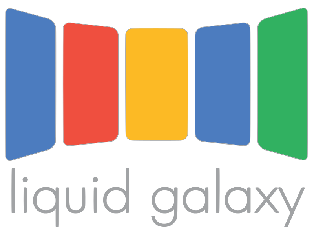
  <br />
  <strong>350 Hr — Local AI with Gemma by Google</strong>
</div>

# Project Documentation

**About this documentation :-**

This documentation covers important concepts, how the project works, how a user can use this / replicate this project on their systems, our progress with GSoC and important references for it.

It is intended for contributors, mentors, and users who want to learn how the system works, deploy it on their own hardware, or build new capabilities on top of it.

The guide begins with the project's goals and architecture, then walks through installation, configuration, and profile restoration before explaining the system's modular skills, practical use cases, and development experience.

Whether you are using it on a Raspberry Pi or any other system with a Liquid Galaxy rig, experimenting with Hermes, or contributing new features, following the documentation in order will provide the necessary background, setup instructions, and references to successfully understand, run, and extend the project.

*If you want to start using it right away, [this installation](#installation) is the way*

## Index

- [Acknowledgement](#about-me--acknowledgement)
- [About the Project](#about-the-project)
- [Example Use Cases (What can you do with current version of project)](#example-use-cases--what-can-you-do-with-current-version-of-project)
- [How you can make new skills](#how-you-can-make-new-skills)
- [Hermes Agent Architecture Explained](#hermes-agent-architecture-explained)
- [About LLM Wiki and Google OKF](#about-llm-wiki-and-google-okf)
- [Hermes Agent Setup](#hermes-agent-setup)
- [Hardware & Setup](#hardware)
- [Installation](#installation)
- [Docker, WSL based setup](#docker-and-wsl-based-setup-for-hermes)
- [Updating Hermes When Using Multiple Profiles](#updating-hermes-when-using-multiple-profiles)
- [Tech Stack](#tech-stack)
- [Voice Mode Config](#voice-support)
- [Architecture design (research)](#skill-architecture-design)
- [Current Status](#current-status)
- [Experiences during development](#experiences-during-development)

---

## About Me & Acknowledgement

I'm Harsh Mehta, a curious engineering student from Pune city, India with a keen interest in learning how real world production systems and projects work. I'm really grateful to Liquid Galaxy Project and the Google Summer of Code for giving this incredible opportunity to learn. It helped me to understand the quality required to work at a stage where the work done by us is actually used in real life by other people and also feel the essence of open source.

Also many thanks to my mentors Andreu Ibáñez, Moisés Martínez also mentor Yash Raj Bharti and Trang, Fabricio, Oriol and Josep and other team members from the Liquid Galaxy Lab in Lleida to test and share valuable feedback on our project.

## About the Project

This project builds Nara…. an AI assistant server that lives on the Liquid Galaxy rig's local network. Nara runs on a Raspberry Pi 5 (or, any other windows, linux or mac based system) connected to the rig via SSH, accepts commands through the CLI, voice or many other external application such as telegram, discord, slack, etc and autonomously generates and pushes content such as KML visualizations, guided tours, real-time data maps, and more directly to the Liquid Galaxy screens.

*The name “Nara” represents the transformation of knowledge into intelligent action. 'Na' represents knowledge and 'Ra' represents illumination*

The system is built as a Hermes agent profile with a modular skill architecture, meaning capabilities can be added, enabled, or disabled independently without touching the core runtime. It supports both fully local AI inference (offline, self-contained) or remote model APIs balancing hardware limits with response quality.

The goal is a stable, easy-to-extend assistant that any LG user, mentor, or contributor can run in the lab or deploy from a backup profile.

---

## Example Use Cases ( What can you do with current version of project)

### Skill name: lg-ssh-control

| | |
| :--- | :--- |
| **Input examples** | "Hey Nara, connect to the LG rig"<br/><br/>"The rig froze mid-tour, can you reboot the rig?"<br/><br/>"Clear every KML that's currently loaded and power the whole rig down, we're done with the lab work for today" |
| **Prompt [added to input]** | User command + SSH credentials + LG IP/port + frame count and lg-ssh-control SKILL.md |
| **Comments** | SSHes into lg1, executes control commands (relaunch/reboot/poweroff/refresh), deploys helpers rig |
| **Expected output** | The agent gives a positive response stating it is connected to liquid galaxy. You are now able to execute basic lg commands such as relaunch, reboot, clear kmls, poweroff, etc. A screenshot of the expected on the lg |

<div align="center">
  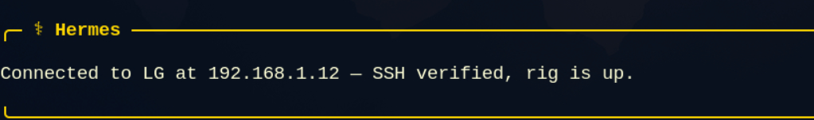
</div>

### Skill name: lg-use-cases

| | |
| :--- | :--- |
| **Input examples** | "Hey Nara, I'm a new student and I've never used this rig before, what exactly can this assistant do for me?"<br/><br/>"Can you walk me through every use case you support so I know what to demo to visitors this weekend?"<br/><br/>"Give me a quick tour of your capabilities, I want to know which skills work offline and which need internet" |
| **Prompt [added to input]** | User query + reference to all developed use cases + layer stacks + camera patterns |
| **Comments** | It will refer all different skills available and act like a user guide for the project. |
| **Expected output** | I have 'X' use cases available: SA Wall, Maritime, Disaster, Energy, Aviation, … And describe the tasks they can do |

<div align="center">
  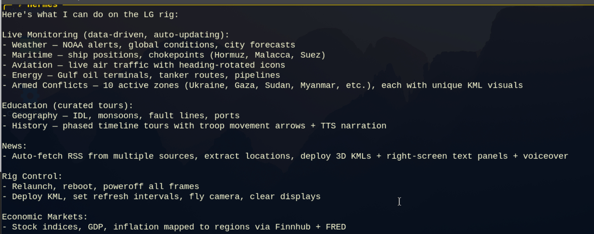
</div>

### Skill name: geography-educator

| | |
| :--- | :--- |
| **Input examples** | "Teach me about the International Date Line and show it on the rig so my class can actually see it"<br/><br/>"Show the India monsoon patterns on LG, I'm trying to understand how it happens"<br/><br/>"Explain how the Turkey earthquake happened and visualize the fault lines while you talk" |
| **Prompt [added to input]** | Topic name + pre-built KML generator + region polygon data + TTS script and its skill.md |
| **Comments** | This skill will fetch relevant concepts and create geographical explainer kmls |
| **Expected output** | Generates educational KML with reference lines, 3D zones, labeled points; deploys with right-screen panel + voiceover |

<div align="center">
  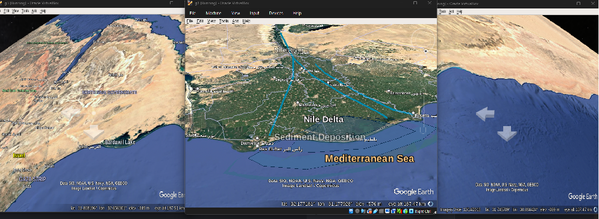
</div>

### Skill name: armed-conflicts

| | |
| :--- | :--- |
| **Input examples** | "Show me all the global conflicts you're tracking right now, I want the full picture"<br/><br/>"Where are the active wars today, and how severe are they?"<br/><br/>"Put the armed conflicts watch on the rig and give me a guided tour with narration" |
| **Prompt [added to input]** | Static conflict zone data (10 zones) + BBC conflict news + decide visual per zone |
| **Comments** | Generates unique dynamic KMLs per zone (front arrows, siege rings, displacement arrows, faction markers, wave spreads); deploys right-screen panel with camera tour and also per-zone TTS |
| **Expected output** | Ukraine: 3D column + front arrow. Gaza: 4 siege rings + 25 damage dots. Touring 10 zones with narration. Example flow |

<div align="center">
  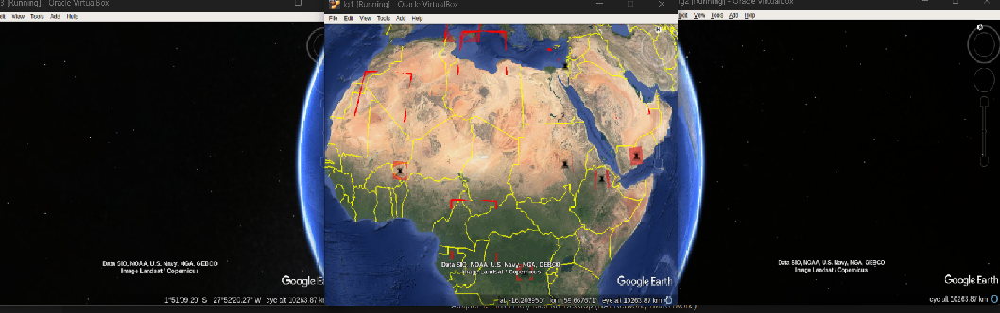
</div>

### Skill name: weather-monitor

| | |
| :--- | :--- |
| **Input examples** | "What's the weather like in Pune right now, and can you show it on the rig?"<br/><br/>"Show me Mumbai's weather, I want to see the temperature and wind visualized in 3D"<br/><br/>"Will it be a good day to visit Madrid tomorrow based on the weather? Can you show it on rig" |
| **Prompt [added to input]** | City name + lat/lon + wttr.in API data and external web search |
| **Comments** | Fetches live weather, generates 3D temperature column (color-coded red=hot/blue=cool), wind arrow, weather icon, right-screen panel + TTS |
| **Expected output** | Shows kmls based on temp and weather conditions along with voice also |

<div align="center">
  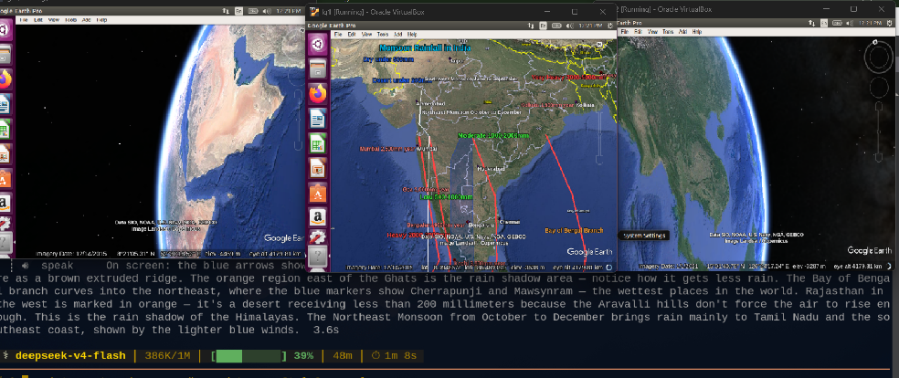
</div>

### Skill name: natural-disaster

| | |
| :--- | :--- |
| **Input examples** | "Show me any earthquakes happening in Japan right now, I want to know how serious they are"<br/><br/>"Any wildfires happening anywhere in Spain that i should know about?" |
| **Prompt [added to input]** | USGS GeoJSON + NASA EONET + NOAA NWS + region input req |
| **Comments** | Fetches live quakes/events, generates 3D colored columns, auto-fly to location, with TTS also states something like — "12 earthquakes, 3 wildfires, 2 weather alerts." |
| **Expected output** | This skill fetches data from multiple APIs to ensure data is as close to truth as possible. It will make KMLs and also give a voiceover in response about natural events |

<div align="center">
  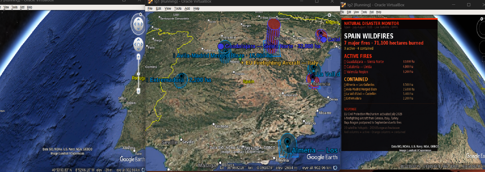
</div>

### Skill name: Live Aviation

| | |
| :--- | :--- |
| **Input examples** | "Show me all the flights currently over Germany, I want to see live air traffic"<br/><br/>"What does air traffic over Europe look like right now, including which airports are busiest?" |
| **Prompt [added to input]** | OpenSky Network API + region input requires + 35 airport, config stored and can be expanded |
| **Comments** | Fetches aircrafts from API, generates heading-rotated plane icons at actual altitude, adds airport markers. |
| **Expected output** | Aircrafts will be visible on liquid galaxy with their labels over them and you can view over region said in the input. |

<div align="center">
  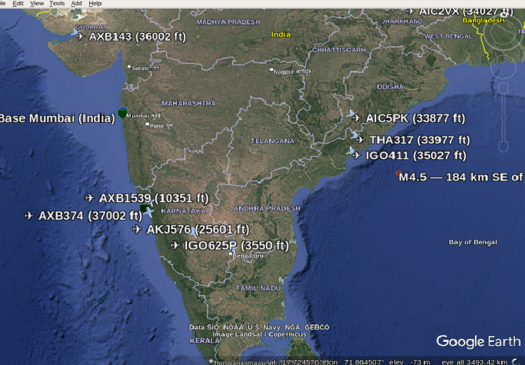
</div>

### Skill name: history-educator

| | |
| :--- | :--- |
| **Input examples** | "Hey nara, tell me about history of WW2"<br/><br/>"teach me about the Roman Empire" "visualize one of the Mongol conquests"<br/><br/>"what happened during the partition of India? Can you explaion" |
| **Prompt [added to input]** | Region, event, time period info req. Web search used to get relevant information with the skill.md |
| **Comments** | It gets all relevant information from your prompt, builds some dramatic phases with territory polygons, advance arrows, battle markers, etc on master.kml. |
| **Expected output** | Different kinds of KML showing regions of interest and rightmost screen shows a parchment-style auto-opened balloon. Camera auto-flies through phases with TTS narration. |

<div align="center">
  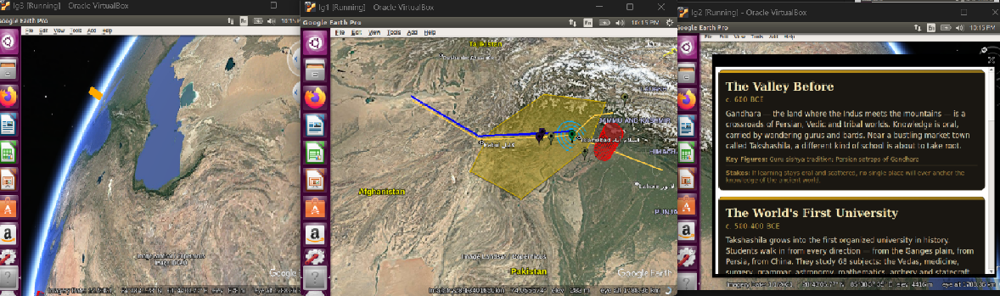
</div>

### Skill name: maritime-awareness

| | |
| :--- | :--- |
| **Input examples** | "Can you show me undersea cables coming to India?"<br/><br/>"show me live tankers in the Red Sea" "hey nara, visualize trade routes near Europe" |
| **Prompt [added to input]** | [AISStream.io](http://AISStream.io), NGA MSI, Telegeography are the data sources. |
| **Comments** | Extracts layer region from your prompt, fetches live or reference data, and builds multi-layer colored KML deployed to master.kml with a navy-blue maritime balloon auto-opened on the rightmost screen |
| **Expected output** | Output will look like many colored lines as KMLs showing cables or routes and markers for vessels. Balloon will have relevant information written |

<div align="center">
  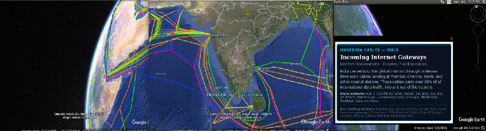
</div>

### Skill name: energy-monitor

| | |
| :--- | :--- |
| **Input examples** | "where are the major oil fields near russia?"<br/><br/>"are there any fuel shortages right now"<br/><br/>"show me renewable energy installations in middle ease"<br/><br/>"where are the biggest solarfarms"<br/><br/>"show mining sites in India" |
| **Prompt [added to input]** | EIA open data, GIE AGSI and IEA oil. World bank power reliability, yahoo finance are all the sources of data used with this skill |
| **Comments** | Extracts region from your prompt, fetches energy data from free APIs, builds multi-layer KML balloon on the rightmost screen no relaunch, 3s refresh. |
| **Expected output** | Rig shows the energy landscape physically oil pipelines in solid black threading solar farms as gold polygons across desert belts, 3D columns rising from coal seams and iron deposits, refineries clustered on coastlines. |

<div align="center">
  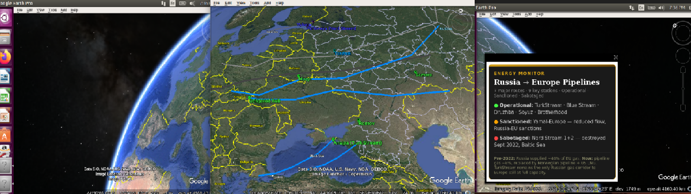
</div>

### Skill name: cyber-infrastructure

| | |
| :--- | :--- |
| **Input examples** | "is there GPS jamming happening anywhere", "show me active "are there any BGP hijacks reports today"<br/><br/>"Show me on lg where is GPS being jammed", "show me DDoS attacks happening now"<br/><br/>"which countries are under cyberattack right now" |
| **Prompt [added to input]** | Cloudflare radar, [gpsjam.org](http://gpsjam.org), Open BGP stream, are some sources added with prompts in skill.md |
| **Comments** | It fetches information from API sources, makes relevant kmls for it and visualizes them on the liquid galaxy |
| **Expected output** | Rig shows the invisible national shutdowns glow as deep red extruded polygons, GPS jamming zones. BGP hijack arcs span between real AS endpoints, IXP nodes marked as digital battlefronts. The rightmost screen is pure black with an electric blue border balloon. |

<div align="center">
  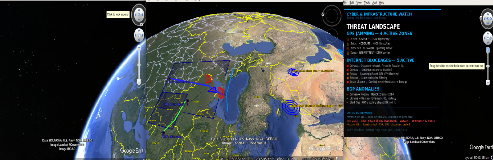
</div>

### Skill name: economic-markets

| | |
| :--- | :--- |
| **Input examples** | "what's the S&P doing today in india"<br/><br/>"how is inflation looking globally"<br/><br/>"which economies are in recession right now" |
| **Prompt [added to input]** | [finhub.io](http://finhub.io), fred org, yahoo finance, alpha vantage, world bank open data are added along with the prompt |
| **Comments** | Fetches live economic and market data, then automatically generates interactive KML visualizations including stock market indicators, macroeconomic heatmaps, currency trends, commodity networks, and financial risk alerts. |
| **Expected output** | Displays global financial markets as an interactive KMLs, where each region is represented by market performance and size through color-coded columns. A balloon shows market indicators, economic events, and overall market sentiment. |

<div align="center">
  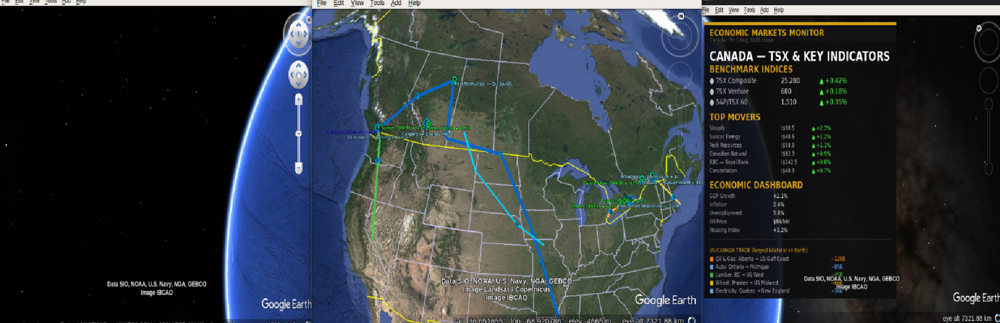
</div>

### Skill name: Animal migration

| | |
| :--- | :--- |
| **Input examples** | "show me where monarch butterflies migrate"<br/><br/>"track the wildebeest migration"<br/><br/>"where do humpback whales travel" |
| **Prompt [added to input]** | Movebank, IUCN, NOAA CDO are few sources of data along with web search |
| **Comments** | Extracts species or region from your prompt, checks the current month for seasonal awareness (which migrations are active right now), fetches route data from Movebank and IUCN, builds 4 layer KML. Species colored LineStrings follow actual terrain corridors with directional arrows. |
| **Expected output** | Rig shows the planet as a web of living movement. Arctic terns looping pole to pole in sky blue, monarchs in orange crossing North America, wildebeest in amber circling the Serengeti, humpbacks in navy crossing oceans. |

<div align="center">
  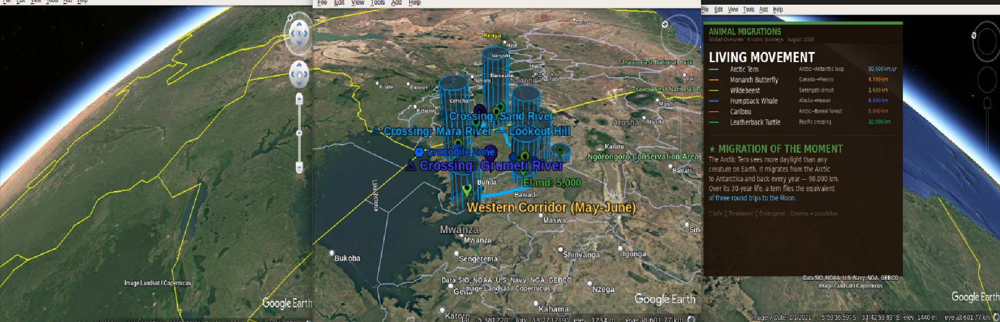
</div>

### Skill name: Coral reef monitor

| | |
| :--- | :--- |
| **Input examples** | "show me coral bleaching on the rig"<br/><br/>"what is the state of the Great Barrier Reef"<br/><br/>"show me global reef health near NA" |
| **Prompt [added to input]** | Noaa coral reef watch, reefbase, AIMS are some data sources used with location information. |
| **Comments** | Extracts reef system or region from your prompt, fetches NOAA and bleaching alert data builds 5 layer KML. Reef polygon outlines trace the 12 major reef systems in fine teal lines following actual reef geography. Bleaching alert fills color each reef by NOAA alert level. |
| **Expected output** | Rig shows the world's reefs under thermal siege. The Great Barrier Reef glows crimson at Alert Level 2 with pulsing rings around its perimeter. The Coral Triangle shows orange warning. The Caribbean still holds teal in some spots, etc |

<div align="center">
  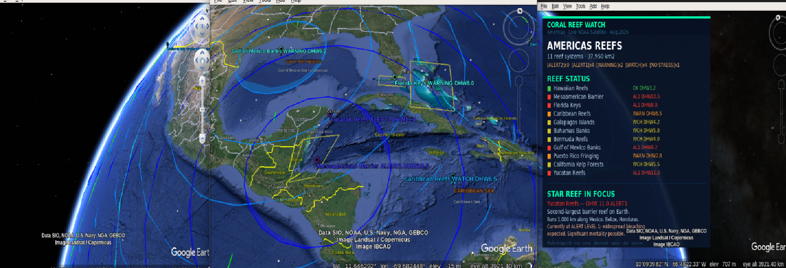
</div>

### Skill name: country-instability-index

| | |
| :--- | :--- |
| **Input examples** | "Put the country instability index on the rig and walk me through the hottest spots"<br/><br/>"Which countries look most unstable right now and can you show it on lg?" |
| **Prompt [added to input]** | User request plus the instability skill and related signals from conflict, markets, cyber, and disaster views |
| **Comments** | Combines several live picture streams into one simple stress score per country. Taller columns mean more pressure. The camera slowly tours the globe so you can see calm regions next to crisis regions, then focuses on the places that rank highest. |
| **Expected output** | A world view with columns rising from countries, a short guided tour of the riskiest areas, and a right-screen summary that explains each country’s main drivers in plain language |
| **Skill.md** | [country-instability-index.md](https://github.com/LiquidGalaxyLAB/local-ai-gemma/blob/main/skills/country-instability-index.md) |

<div align="center">
  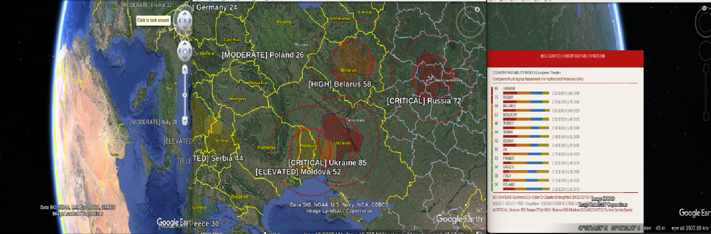
</div>

### Skill name: prediction-markets-geo [eg polymarket]

| | |
| :--- | :--- |
| **Input examples** | "What are prediction markets saying about elections and conflicts right now? Show it on the globe"<br/><br/>"Map Polymarket odds for the big geopolitical questions and fly me between the high-stakes places" |
| **Prompt [added to input]** | User topic or region plus public prediction-market odds for politics, conflict, sanctions, and similar events |
| **Comments** | Reads open betting markets and places each question on the map near the country it is about. Rings grow or pulse where odds are uncertain. Places where traders mostly agree look calmer. The camera moves between the markets that matter most. |
| **Expected output** | Colored rings on the globe for each market, a fly-through of the most interesting bets, and a right-screen panel that states the question, the current odds, and a short plain-language takeaway |
| **Skill.md** | [prediction-markets-geo.md](https://github.com/LiquidGalaxyLAB/local-ai-gemma/blob/main/skills/prediction-markets-geo.md) |

<div align="center">
  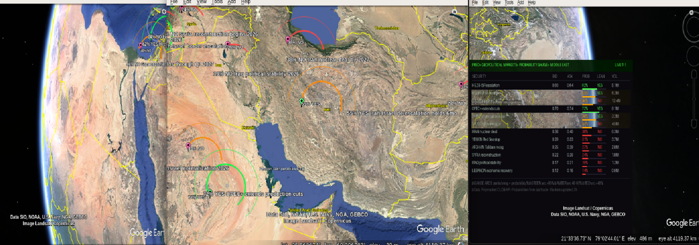
</div>

### Skill name: global-progress-dashboard

| | |
| :--- | :--- |
| **Input examples** | "Map global progress on poverty, child health, and clean energy, then narrate a short tour"<br/><br/>"I need an uplifting demo for visitors. Highlight regions that improved the most and explain why it matters." |
| **Prompt [added to input]** | User demo goal plus open public data on poverty, health, energy, life expectancy, and disease progress |
| **Comments** | Pulls well-known global improvement stats (mainly web search and RSS news feeds) and turns them into a hopeful map for classrooms and public demos. Instead of only crisis news, it shows trends that are getting better, with warm colors and a friendly guided tour. |
| **Expected output** | A bright progress map on the screens, columns or regions that show gains over time, a short narrated tour, and a right-screen panel with a few clear facts visitors can remember |
| **Skill.md** | [global-progress-dashboard.md](https://github.com/LiquidGalaxyLAB/local-ai-gemma/blob/main/skills/global-progress-dashboard.md) |

<div align="center">
  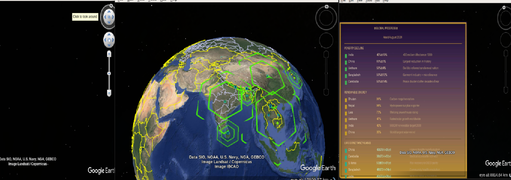
</div>

### Skill name: deforestation-monitor

| | |
| :--- | :--- |
| **Input examples** | "Show live deforestation and forest fires on the rig, starting with the Amazon"<br/><br/>"Where are forests being lost right now, and which protected areas are under pressure?" |
| **Prompt [added to input]** | User region or theme plus forest-fire alerts, tree-loss trends, wildlife hotspot maps, and protected-area outlines |
| **Comments** | GFW API, open epi, Open foris and web search sources |
| **Expected output** | Fire markers and forest-loss coloring on the globe, outlines for important habitats and parks, a tour of major deforestation fronts, and a right-screen brief on what you are seeing |
| **Skill.md** | [deforestation-monitor.md](https://github.com/LiquidGalaxyLAB/local-ai-gemma/blob/main/skills/deforestation-monitor.md) |

<div align="center">
  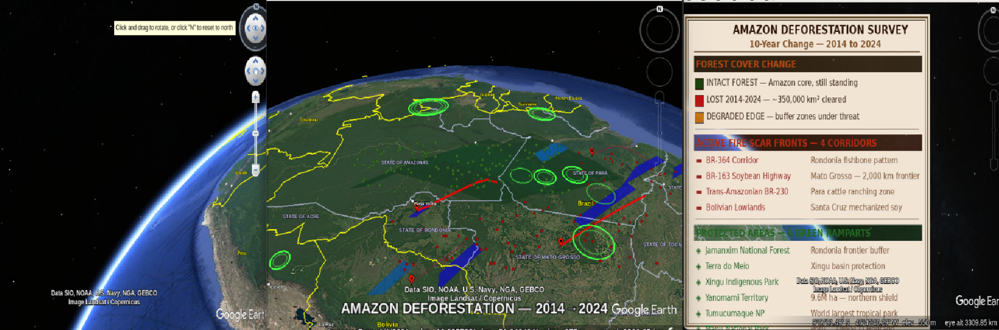
</div>

### Skill name: satellite-orbital-tracker

| | |
| :--- | :--- |
| **Input examples** | "Show the International Space Station on the rig and follow its path"<br/><br/>"Put a satellite tracker on the LG with Starlink and a few famous missions, and explain what I am looking at" |
| **Prompt [added to input]** | User target (ISS, Hubble, Starlink, or general tracker) plus public orbit catalogs |
| **Comments** | Places real satellites and stations around a 3D Earth at roughly the height they actually fly. You can follow the ISS, see dense internet constellations, and compare low orbits with much higher navigation shells. The camera can rise step by step so height becomes easy to understand. |
| **Expected output** | Markers and paths around the globe, a climb through different orbit heights, labels for well-known objects, and a right-screen mission-style panel that names what is on screen |
| **Skill.md** | [satellite-orbital-tracker.md](https://github.com/LiquidGalaxyLAB/local-ai-gemma/blob/main/skills/satellite-orbital-tracker.md) |

<div align="center">
  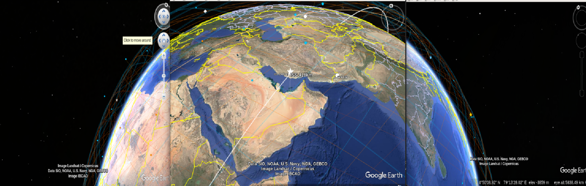
</div>

### Liquid galaxy setup helper

This is a new and special skill which will help users to setup a virtual liquid galaxy on their system.

[SKILL.md](https://github.com/LiquidGalaxyLAB/local-ai-gemma/blob/main/skills/lg-installation-setup.md)

**What It Is**

It is a simple step-by-step guide for building a Liquid Galaxy virtual machine rig from scratch.

Think of it like an installation guide and automated skill for setting up a multi-screen Liquid Galaxy display rig using Ubuntu 16.04 virtual machines. It outlines how a user sets up three VMs with standard network adapters, followed by how an AI agent configures SSH access, repairs system bugs, and assigns frame IDs

**Example prompts**

> "Help me set up a 3-screen Liquid Galaxy rig using VirtualBox on Ubuntu 16.04."

> "I just created three blank VMs (lg1, lg2, lg3) for Liquid Galaxy. How do I configure the network adapters and SSH access?"

It uses context from lg wiki and my training where i setup my rig using this skill

### How are the skills related?

The system is built in layers so that every feature can reuse the same core capabilities instead of rebuilding them. The lg-ssh-control skill handles communication with the Liquid Galaxy rig, while lg-kml-tours provides common visualization components such as information cards and 3D objects. The lg-data-visualization skill collects and verifies live data, giving all other skills a consistent foundation.

Each domain has its own specialized skill and visual style. These include news storytelling, history education, armed conflicts, maritime awareness, energy monitoring, cyber infrastructure, economic markets, and aviation watch. Every skill is designed to present information in a way that best fits its topic while sharing the same underlying framework.

The skills are also connected intelligently. Instead of duplicating data or features, they reuse information from one another whenever possible. All visualizations follow the same deployment process, update automatically on the Liquid Galaxy rig without restarting it, and use a consistent layout for dashboards and screen placement.

---

## How you can make new skills?

One of the coolest things about this project is that anyone can teach the agent a new skill, and you do not need to know how to code or even touch any files to do it. **You just talk to Hermes and describe what you want the skill to do.** Hermes handles creating the skill file for you behind the scenes.

**New Skill Creation with Hermes**

Describe the skill in natural language: Tell Hermes what you want Nara to accomplish. You do not need to specify file formats, folder structures, or implementation details.

Be as specific as possible. A detailed description produces a more reliable skill.

Hermes may ask follow-up questions when requirements are unclear, then determines the skill structure and builds it.

A good skill description should define:

* Purpose – What the skill should do.
* Triggers – Example user questions or phrases that should activate it.
* Data source – APIs or external sources the skill should use.
* Liquid Galaxy visualization – What should appear on the rig, including colors, markers, paths, columns, etc.
* Camera behavior – How the camera should move or transition between locations.
* Rightmost screen – What information or summary should be displayed there.
* Agent response – What Nara should tell the user after completing the task.
* Edge cases – What to do when data is unavailable, incomplete, or the API returns no results.
* Visual style – Any preferred color coding, severity indicators, camera speed, transitions, or other presentation details.

**Example:**

Instead of saying “Create a wildfire skill,” describe it as: “Create a skill that fetches live wildfire data from NASA EONET, displays active fires as red columns on the Liquid Galaxy rig, moves the camera between affected regions, shows a summary on the rightmost screen, and reports the number of active fires to the user.”

**Key principle:** Treat the skill description like a detailed briefing. The more context and expected behavior you provide upfront, the better Hermes can build the skill on the first attempt.

---

## Hermes Agent Architecture Explained

<div align="center">
  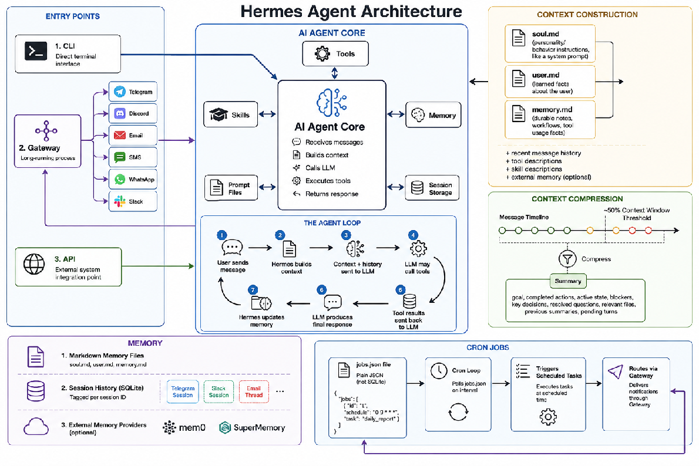
  <br />
  <em>Credit to Alejandro from Hugging Face</em>
  <br />
  <a href="https://youtu.be/n32qq7Kwzh0?si=EGcxNw3M5xKGTXeC">https://youtu.be/n32qq7Kwzh0?si=EGcxNw3M5xKGTXeC</a>
</div>

Hermes is built around a single core agent process that everything else plugs into. Instead of only living in a terminal, it exposes three entry points: a CLI for direct local use, an API for programmatic integration, and a long-running Gateway process that bridges the agent to messaging platforms like Telegram, Discord, Slack, WhatsApp, SMS, and email. This means the same agent can be talked to from a chat app just as easily as from a script.

At the heart of every interaction is what the architecture calls the agent loop: a message comes in, Hermes assembles the relevant context, sends it to the LLM along with tool definitions, lets the model call tools if needed, feeds tool results back in, generates a final answer, and then updates its memory before waiting for the next message. It's a simple, repeatable cycle rather than a one-shot request/response.

What makes that loop useful over time is how context is built and managed. Hermes keeps a small set of markdown files that act like a personality and knowledge base, one for behavior and tone, one for facts it's learned about the user, and one for durable notes on workflows and tool usage. These get loaded alongside recent conversation history and descriptions of available tools and skills each time the agent runs. When a conversation grows long enough to threaten the context window (roughly past the halfway point), older messages get compressed into a structured summary; capturing the goal, what's been done, open blockers, key decisions, and relevant files, so the agent doesn't lose the thread without blowing up its context budget.

Memory itself is split across three layers: the markdown files mentioned above for persistent knowledge, a SQLite-backed session history that's kept separate per conversation (so your Telegram thread and your email thread don't bleed into each other), and optionally an external memory provider for teams that want something more heavyweight.

Finally, Hermes supports scheduled autonomy through a lightweight cron system. Jobs are stored in a plain JSON file rather than a database, polled on an interval, and when triggered, they route back out through the same Gateway used for regular conversations; so a scheduled task can, for example, message you on Slack without needing a separate notification system.

The overall design philosophy is to keep the "thinking" part (the LLM call and tool use) simple and stateless per turn, while pushing all the complexity of continuity; memory, compression, multi-channel delivery; into supporting systems around it.

---

## About LLM Wiki and Google OKF

[LLM Wiki](https://gist.github.com/karpathy/442a6bf555914893e9891c11519de94f) — Most people's experience with LLMs and documents looks like-

Lets say you upload a collection of files, the LLM retrieves relevant chunks at query time, and generates an answer. This works, but the LLM is rediscovering knowledge from scratch on every question. There's no accumulation. Ask a subtle question that requires synthesizing five documents, and the LLM has to find and piece together the relevant fragments every time. Nothing is built up. NotebookLM, ChatGPT file uploads, and most RAG systems work this way.

The idea here is different. Instead of just retrieving from raw documents at query time, the LLM incrementally builds and maintains a persistent wiki - a structured, interlinked collection of markdown files that sits between you and the raw sources. When you add a new source, the LLM doesn't just index it for later retrieval. It reads it, extracts the key information, and integrates it into the existing wiki; updating entity pages, revising topic summaries, noting where new data contradicts old claims, strengthening or challenging the evolving synthesis. The knowledge is compiled once and then kept current, not re-derived on every query.

This is the key difference: the wiki is a persistent, compounding artifact. The cross-references are already there. The contradictions have already been flagged. The synthesis already reflects everything you've read. The wiki keeps getting richer with every source you add and every question you ask.

You never (or rarely) write the wiki yourself, the LLM writes and maintains all of it.

**Key operations**

**Ingest:** When you add a new document, the LLM reads it, summarizes it, and automatically updates all relevant entity pages, indexes, and cross-references.

**Query:** You ask questions, and the LLM synthesizes answers from the pre-compiled wiki. If you uncover a great insight, you file that answer right back into the wiki as a new page.

**Lint (The Health Check):** Periodically, the LLM scans the wiki to fix broken links, flag contradictions between old and new files, detect duplicate pages, and point out information gaps.

**LLM wiki in Hermes**

<div align="center">
  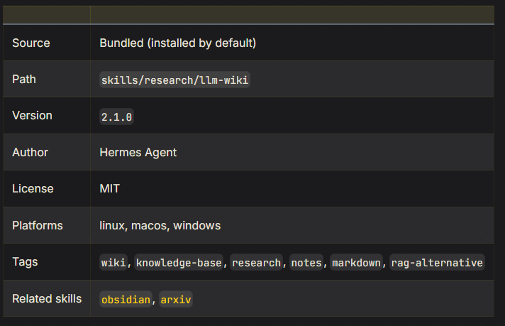
  <br />
  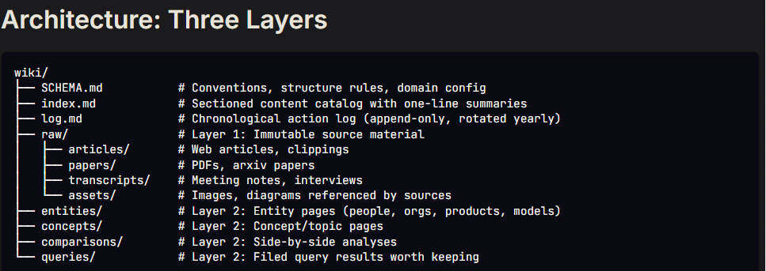
</div>

The Hermes itself has added a skill for LLM wiki

* Asks to create, build, or start a wiki or knowledge base
* Asks to ingest, add, or process a source into their wiki
* Asks a question and an existing wiki is present at the configured path
* Asks to lint, audit, or health-check their wiki
* References their wiki, knowledge base, or "notes" in a research context

**Location:** Set via `WIKI_PATH` environment variable (e.g. in `${HERMES_HOME:-~/.hermes}/.env`).

If unset, defaults to `~/wiki`.

[Google’s OKF Format](https://cloud.google.com/blog/products/data-analytics/how-the-open-knowledge-format-can-improve-data-sharing) — Open Knowledge Format (OKF) is a vendor-neutral standard designed to formalize how AI agents organize, package, and exchange knowledge.

The LLM Wiki acts as the "compiler." It takes messy PDFs, raw web scrapes, and slack logs, processes them, lints them for broken links, resolves contradictions, and builds a synthesized local database.

OKF acts as the "export format." Once your LLM Wiki has compiled your core knowledge, you export it as an OKF bundle. This bundle can then be zipped up and handed to any other compatible agent (whether it's on Google Cloud, a local Ollama instance, or Claude Code) and it will immediately understand your data structure with zero translation code required.

**3 principles of OKF**

1. **Just markdown** : readable in any editor, renderable on GitHub, indexable by any search tool
2. **Just files** : shippable as a tarball, hostable in any git repo, mountable on any filesystem
3. **Just YAML frontmatter** : for the small set of structured fields that need to be queryable: type, title, description, resource, tags, and timestamp

---

## Hermes Agent Setup

The self-improving AI agent built by Nous Research. The only agent with a built-in learning loop, it creates skills from experience, improves them during use, nudges itself to persist knowledge, and builds a deepening model of who you are across sessions.

Website: [https://hermes-agent.nousresearch.com/](https://hermes-agent.nousresearch.com/)

### Some Important Features to know for setup

**Profiles**

According to their official documentation we can define a [profile](https://hermes-agent.nousresearch.com/docs/user-guide/profiles) as a self-contained Hermes home directory. Starting with one profile (`liquid-galaxy-agent`)

Each profile gets its own config.yaml, .env, SOUL.md, memories, sessions, skills, cron jobs, and state database. **Basically** its own directories which work independently from other profiles! A clean slate.

**Backups**

[Backups](https://hermes-agent.nousresearch.com/docs/getting-started/updating#full-pre-update-backup---backup) create a zip archive of config, skills, sessions, and data, everything except the codebase. Restore with [hermes import](https://hermes-agent.nousresearch.com/docs/reference/cli-commands#hermes-import).

* CLI Session: Handles interactive terminal UIs. Triggers conversation loop, builds system prompts, resolves model providers, executes tools, persists history.
* Gateway Message: Manages 20+ messaging platform adapters (Discord, Slack, WhatsApp, etc.). Handles auth, session isolation, response routing.

---

## Hardware

<div align="center">
  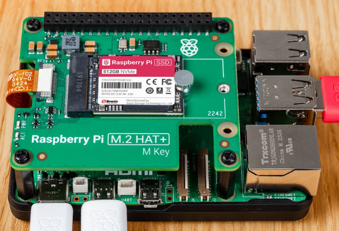
</div>

* **SBC:** Raspberry Pi 5, 8GB RAM
* **Storage:** 512GB / 256GB NVMe SSD
* **NVMe Interface:** Raspberry Pi M.2 HAT+
* **Boot Media:** 16GB+ microSD card (for initial setup only)
* **Power:** Raspberry Pi 27W USB-C Power Supply

## Hardware Setup

**Step 1 — Attach NVMe SSD via M.2 HAT**

1. Power off and unplug the Raspberry Pi 5.
2. Attach the Raspberry Pi M.2 HAT+ to the RPi 5 using the PCIe FPC ribbon cable — connect it to the PCIe FPC connector on the bottom edge of the RPi 5 board. Secure the HAT with the provided standoffs.
3. Insert the 512GB NVMe SSD (M.2 2280 or 2242, M-key) into the M.2 slot on the HAT. Secure it with the retention screw.
4. Confirm the HAT sits flat and all connectors are fully seated before proceeding.

> ⚠️ Handle the PCIe ribbon cable with care, it is fragile. Ensure the blue side faces up when inserting into the RPi 5 connector.

**Step 2 — Flash Raspberry Pi OS to SD Card**

1. On your computer, download and install [Raspberry Pi Imager](https://www.raspberrypi.com/software/).
2. Insert your 16GB+ microSD card into your computer.
3. Open RPi Imager and configure:
   - Device: Raspberry Pi 5
   - OS: Raspberry Pi OS (64-bit) — recommended: the full Desktop version for initial setup
   - Storage: Select your microSD card
4. Click the Edit Settings (⚙️) button before writing:
   - Set hostname (e.g. nara.local)
   - Enable SSH → Use password authentication
   - Set username and password (e.g. user: pi, password: your choice)
   - Configure Wi-Fi if needed
5. Click Save → Yes → Write and wait for the flash to complete.

**Step 3 — First Boot from SD Card**

1. Insert the flashed microSD card into the Raspberry Pi 5.
2. Connect a monitor, keyboard, and mouse (or use SSH after boot).
3. Connect power — the RPi 5 will boot from the SD card.
4. Complete the initial OS setup if the desktop wizard appears.
5. Open a terminal and run a system update:

```bash
sudo apt update && sudo apt full-upgrade -y
sudo reboot
```

**Step 4 — Flash OS to NVMe SSD**

With the RPi running from SD, use RPi Imager (already installed on Raspberry Pi OS) to write the OS directly to the NVMe:

1. Open Raspberry Pi Imager from the desktop (or run rpi-imager).
2. Configure the same settings as Step 2 (or reuse your saved customizations).
3. Storage: Select the NVMe drive (`/dev/nvme0n1` — typically listed as the 512GB drive).
4. Click Write and wait for the process to complete.

**Step 5 — Configure NVMe Boot Order**

Tell the Raspberry Pi 5 bootloader to prefer the NVMe SSD over the SD card.

**Option A — via raspi-config (recommended):**

```bash
sudo raspi-config
```

Navigate to: Advanced Options → Boot Order → NVMe/USB Boot

Select NVMe, confirm, and exit. Apply when prompted.

**Option B — via EEPROM config (manual):**

```bash
sudo -E rpi-eeprom-config --edit
```

Find the `BOOT_ORDER` line and set it to:

```text
BOOT_ORDER=0xf61
```

Boot order is read right-to-left: `6` = NVMe (PCIe), `1` = SD card, `f` = loop/restart.
This means: try NVMe first → fall back to SD → repeat.

Save, exit, and apply:

```bash
sudo reboot
```

**Step 6 — Boot from NVMe**

1. After the reboot, power off the Raspberry Pi 5:

```bash
sudo poweroff
```

2. Remove the microSD card.
3. Power the RPi 5 back on.
4. The system should now boot directly from the NVMe SSD.
5. Verify with:

```bash
findmnt /
# Should show: /dev/nvme0n1p2 or similar — not mmcblk0
```

If the RPi fails to boot without the SD card, revisit Step 5 and confirm the EEPROM boot order was saved correctly.

---

## Installation

Get Hermes Agent up and running!

A couple of terms you'll see everywhere below:

**Terminal** : the black text-window where you type commands instead of clicking icons.

**Shell** : the program running inside the terminal that reads your commands (bash and zsh are two common ones).

**Archive file** (.zip / .tar.gz) : a single file that contains a bunch of other files and folders squashed together, like a suitcase you pack and unpack.

First, Download the latest version of backup zip on your raspberry pi 5.

[Backup download](https://drive.google.com/drive/folders/1mQyJYMV7bvj-cq7geYF7AcXGROvqjj-z?usp=sharing)

Folders are present with dates. Choose the latest date folder and use the hermes / profile backup.

### Quick Install

With Hermes Desktop (recommended for macOS / Windows): Download the [Hermes Desktop installer](https://hermes-agent.nousresearch.com/) from the website and run it.

You can check out this setup video that I made

[https://youtu.be/r77kEcoE7Sw?si=a9vfaL3OiTqQK0gE](https://youtu.be/r77kEcoE7Sw?si=a9vfaL3OiTqQK0gE)

**Installing hermes agent**

Below is the Command-line only (this is what you want for a Raspberry Pi)

To use on some other platform such as windows, mac or linux machine refer to the [docker or wsl2 based setup](#docker-and-wsl-based-setup-for-hermes).

Raspberry Pi 5 runs Linux, so use the Linux install command, run directly in your Pi's terminal:

```bash
curl -fsSL https://hermes-agent.nousresearch.com/install.sh | bash
```

What this line actually does, piece by piece:

`curl -fsSL <url>` downloads the installer script from that web address.

`| bash` pipes (feeds) that downloaded script straight into bash so it runs immediately.

The script then quietly installs Python, Node.js, and other tools it needs, downloads the Hermes Agent code, sets up an isolated Python environment for it (called a "virtual environment" it keeps Hermes's software separate from anything else on your system), and creates a hermes command you can type from anywhere.

This will take a few minutes. Let it finish completely before doing anything else.

### Restoring the Liquid Galaxy Profile

You have two ways to bring the Liquid Galaxy project's Hermes setup onto this Pi. Which one you should use depends on whether this Pi already has other Hermes work on it that you care about.

**Quick decision guide**

| Your situation | Use |
| ----- | ----- |
| This is a brand-new Hermes install, nothing to lose | Approach 1 |
| You already have your own chats/config/skills on this Pi and don't want to lose them. (Means you already use hermes and don't want to lose your older hermes data or hermes chats) | Approach 2 |

### Approach 1 is Full Backup Restore (This Overwrites Everything)

Use this only if you are starting from a fresh Hermes install with no existing work. This replaces your entire `~/.hermes/` directory — config, skills, sessions, memories, everything.

**Step 1 — Locate the backup archive** on [the drive link](https://drive.google.com/drive/folders/1mQyJYMV7bvj-cq7geYF7AcXGROvqjj-z)

You should have a .zip file (e.g., `hermes-backup-YYYY-MM-DD-HHMMSS.zip`).

**Step 2 — Restore it using the built-in command**

```bash
hermes import /path/to/hermes-backup-YYYY-MM-DD-HHMMSS.zip
```

Replace `/path/to/...` with wherever the file actually landed (for example, `~/Downloads/hermes-backup-...zip`).

**Step 3 — Configure API keys**

The restored backup includes settings, but you'll still need to tell Hermes which AI provider and API key to use on *this* machine.

Start Hermes and configure your LLM provider:

```bash
hermes
```

Then in the session, run:

```text
/model      # Choose your LLM provider and model
/config     # Check settings
```

Or use the CLI commands:

```bash
hermes model          # Interactive model/provider picker
hermes tools          # Configure which tools are enabled
hermes setup          # Or run the full setup wizard
hermes config set     # Set individual config values
```

**Step 4 — Verify**

```bash
hermes doctor         # Check everything is working
```

### Approach 2 : Profile Import (Preserves Your Data)

Use this if you already have Hermes set up with your own work and just want to add the Liquid Galaxy profile alongside it. This does not touch your existing profile at all.

This is the safer option. Hermes supports profiles …. Think of a profile as a separate, self-contained "workspace" for Hermes, each with its own settings, skills, and chat history, that all live side-by-side without touching each other. Importing the Liquid Galaxy profile just adds a new workspace and it does not touch anything you already have.

Profile name for this project is `liquid-galaxy-agent`

**Step 1 — Get the exported profile file**

You should have a .tar.gz file (e.g., `liquid-galaxy-agent.tar.gz`) in [drive folder](https://drive.google.com/drive/folders/1mQyJYMV7bvj-cq7geYF7AcXGROvqjj-z). This is the exported profile archive.

**Step 2 — Import it**

```bash
hermes profile import /path/to/liquid-galaxy-agent.tar.gz --name liquid-galaxy-agent
```

This creates a new profile called liquid-galaxy-agent inside your existing `~/.hermes/profiles/` directory. Your own profiles are completely untouched.

**Step 3 — Switch to the Liquid Galaxy profile**

```bash
hermes profile use liquid-galaxy-agent
```

**Step 4 — Configure API keys**

The profile has all the Liquid Galaxy skills and config, but you still need to add your own LLM API key:

```bash
hermes model          # Choose your LLM provider and model
hermes tools          # Check which tools are enabled
hermes doctor         # Verify everything is reading correctly
```

**Step 5 — Start using it**

```bash
hermes                # Start chatting
```

**Step 6 — Switching between profiles later**

```bash
hermes profile list                    # See all profiles
hermes profile use liquid-galaxy-agent # Switch to LG profile
hermes profile use default             # Switch back to your own
```

Or run Hermes with a specific profile in one command:

```bash
hermes --profile liquid-galaxy-agent
```

### Verify Everything is Working (Both Approaches)

Run the built-in diagnostic tool to make sure Hermes sees the restored data and isn't throwing errors:

```bash
hermes doctor
```

**Troubleshooting**

| Problem | Fix |
| ----- | ----- |
| `hermes: command not found` after install | Run `source ~/.bashrc` again, or open a brand-new terminal window |
| It says an API key isn't set | Run `hermes model`, or `hermes config set OPENROUTER_API_KEY your_key_here` |
| Something seems broken after restoring/importing | Run `hermes doctor` — it diagnoses the exact issue |

Reference: [https://hermes-agent.nousresearch.com/docs/](https://hermes-agent.nousresearch.com/docs/)

---

## Updating Hermes When Using Multiple Profiles

If you’re having more than one profile for Hermes, always switch to the default profile before running hermes update. To do this follow the commands : (In linux terminal not Hermes shell)

Check the available profiles:

```bash
hermes profile list
```

Switch to default profile:

```bash
hermes profile use default
```

Update Hermes:

```bash
hermes update
```

Updating from the default profile helps avoid problems that can occur when updating while a custom profile is active.

**Restoring a Backup**

Once the update is complete, switch back to the profile where you want to restore the backup.

```bash
hermes profile use <your-profile-name>
```

**Note:** Always run hermes update from the Linux terminal while the default profile is active. After the update finishes, switch back to your required profile and restore the backup there. This helps prevent issues with custom profiles during the update process.

---

## Docker and WSL based setup for Hermes

<div align="center">
  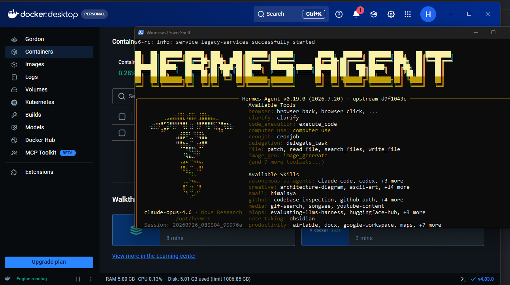
</div>

**Core Architecture Overview**

**What is WSL2 (Windows Subsystem for Linux)?**

WSL2 is a Microsoft feature that allows developers to run a lightweight, native Linux environment (such as Ubuntu) directly inside Windows 10/11 without the heavy overhead of a traditional virtual machine.

* How it works: It uses a highly optimized, custom Linux kernel running inside a lightweight utility VM. It achieves near-native file system performance and seamless integration with Windows hardware resources

**What is Docker?**

Docker is an open-source platform designed to package, deploy, and run applications inside isolated environments called containers.

* How it works: Instead of virtualizing entire hardware layers (like standard VMs), Docker shares the host operating system's kernel. Containers pack the application code, dependencies, and binaries together, ensuring the software runs identically on any machine. On Windows, Docker Desktop leverages the WSL2 backend architecture to run Linux containers with extreme efficiency.

Run these commands to set up a continuous, long-running Hermes Agent that saves your progress

You may also refer the [Official Docs](https://hermes-agent.nousresearch.com/docs/user-guide/docker) for Docker setup

For macOS and Linux, you do not need wsl2. For windows you can download it using this command in your terminal

```powershell
wsl --install --no-distribution
```

**Step 1: Docker setup**

**Windows**

Use powershell as administrator access. (To do this just goto windows search and type powershell, then click run as admin)

```powershell
# 1. Install the WSL Linux backend architecture
wsl --install --no-distribution

# 2. Download and install Docker Desktop silently
curl.exe -L -o DockerDesktop.exe "https://docker.com"
Start-Process ./DockerDesktop.exe -ArgumentList "/quiet", "/accept-license" -Wait

# 3. Restart your computer to complete setup, then open the Docker Desktop app.
```

**macOS**

Open terminal and run the following commands-

```bash
curl -o Docker.dmg "https://docker.com"
sudo hdiutil attach Docker.dmg
sudo cp -R /Volumes/Docker/Docker.app /Applications
sudo hdiutil detach /Volumes/Docker
open /Applications/Docker.app
```

**Linux (Ubuntu/Debian Terminal)**

```bash
# 1. Run the official automated installation script
curl -fsSL https://docker.com | sh

# 2. Add your user to the docker group so you don't need 'sudo' every time
sudo usermod -aG docker $USER

# 3. Apply the changes immediately
newgrp docker
```

**Step 2: Initialize Configuration Profile**

Create a local directory of your choice and execute the command given below:

```bash
# Create and enter your preferred workspace directory
mkdir <YOUR_WORKSPACE_DIR>
cd <YOUR_WORKSPACE_DIR>

# Run the setup wizard to input API keys and generate configs
docker run -it --rm \
  -v ~/.hermes:/opt/data \
  nousresearch/hermes-agent setup
```

This drops you into the setup wizard, which will prompt you for your API keys and write them to `~/.hermes/.env`. You only need to do this once. It is highly recommended to set up a chat system for the gateway to work with at this point.

To open an interactive chat session against a running data directory:

```bash
docker run -it --rm \
  -v ~/.hermes:/opt/data \
  nousresearch/hermes-agent
```

You can also run the agent directly using WSL (Windows subsystem for linux)

Install wsl2 using this command -

```powershell
wsl --install -d Ubuntu    # you can select distro as per your wish but ubuntu is the most common one
```

Now start the ubuntu

```powershell
wsl -d Ubuntu
```

(Windows will open a separate terminal window and prompt you to create a Unix username and password. Do that, and you are officially inside a pure Linux terminal environment!)

Then run this script and you’re done!

```bash
curl -fsSLO https://raw.githubusercontent.com/NousResearch/hermes-agent/main/scripts/install.sh
```

---

## Tech Stack

* Agent Runtime: Hermes, Multi-agent orchestration
* AI / Models: Ollama or LMstudio (local inference), Remote model APIs
* Visualization: KML, Google Earth, Liquid Galaxy
* Communication: WebSockets, REST
* Data Sources: OpenSky Network, Celestrak, RSS Feeds, Weather API, etc
* Hardware Interface: SSH, sshpass, Shell scripting
* Languages: Python, Shell

---

## Voice Support

Hermes Agent allows us to interact using voice. This is a built in feature that consists of 2 parts,

**Text-to-Speech (TTS)**: The agent converts its text responses into spoken audio files or native voice messages.

**Speech-to-Text (STT)**: When you send a voice note to the agent, it automatically transcribes your audio into text so the agent can read and reply to it.

We can choose from a variety of different providers (free & paid) for TTS and STT based on requirements.

### Enabling Voice Mode in Hermes Agent

The easiest way is to ask the agent in cli to enable voice model if not already done. It will install the dependencies and detect your microphone.

> “ Enable voice mode for Hermes, speech to text and text to speech “

If we stick to default providers we don't need any api keys or extra settings

Once the voice mode is enabled just use `/voice tts` or `/voice on` in hermes cli and it works.

**Note-** Your Raspberry Pi must have a microphone and speaker for the input and output to work.

Before using voice mode, make sure your Raspberry Pi can detect both the microphone (audio input) and the speaker (audio output). Hermes uses the operating system's default audio devices, so the correct input and output devices must be configured beforehand.

Hermes agent can also help you configure these.

These can be built-in devices or external USB devices, such as a USB microphone and USB speaker. Hermes uses the Raspberry Pi's default audio devices, so you must configure the audio routing to use the correct microphone and speaker before enabling voice mode. You can verify and select the default input and output devices using the Raspberry Pi audio settings (raspi-config or the Desktop Audio Device Settings) or Linux audio tools such as alsamixer, `aplay -l`, and `arecord -l`. After configuring the routing, it is recommended to test both the microphone and speaker to ensure audio input and output are working correctly.

### Using Voice Mode

Once Hermes is running, you can control voice mode using the following commands.

| Command | Description |
| :---- | :---- |
| `/voice on` | Enables full voice conversation. Speak to Hermes and hear spoken responses. |
| `/voice tts` | Hermes will always read its responses aloud. |
| `/voice off` | Disables all voice features. |

### Available Providers

**Speech-to-Text (STT)**

| Provider | Environment Variable | Free |
| :---- | :---- | :---- |
| local (Faster Whisper) | None | ✅ Yes |
| Groq | `GROQ_API_KEY` | ✅ Free tier |
| OpenAI | `VOICE_TOOLS_OPENAI_KEY` | ❌ Paid |
| Mistral | `MISTRAL_API_KEY` | ❌ Paid |

**Text-to-Speech (TTS)**

| Provider | Environment Variable | Free |
| :---- | :---- | :---- |
| Edge | None | ✅ Yes |
| ElevenLabs | `ELEVENLABS_API_KEY` | ✅ Free tier |
| OpenAI | `VOICE_TOOLS_OPENAI_KEY` | ❌ Paid |
| MiniMax | `MINIMAX_API_KEY` | ❌ Paid |
| Mistral | `MISTRAL_API_KEY` | ❌ Paid |
| NeuTTS (Local) | None (`pip install neutts[all]`) | ✅ Yes |

You can keep it default and choose not to go for any manual configuration of the providers. Edge and faster whisper work well!

**Elevenlabs Voice**

We know that Voice interaction runs as a two-way pipeline. Incoming audio is transcribed to text before reaching the Hermes LLM, and the generated response is converted back to speech.

Text-to-Speech (TTS): Powered by ElevenLabs models (such as `eleven_flash_v2_5` for low-latency live conversation or `eleven_multilingual_v2` for general use) linked to a specific `voice_id`.

Speech-to-Text (STT): Driven by ElevenLabs Scribe (`scribe_v2`), which automatically handles transcription for incoming voice messages across connected channels (e.g., CLI, Telegram, Discord, WhatsApp, Slack, Signal).

**Setup Commands**

1. Environment & Dependencies

Add your ElevenLabs API key to `~/.hermes/.env`:

```bash
ELEVENLABS_API_KEY=your_key_here
```

If premium TTS dependencies are missing, install them:

```bash
pip install "hermes-agent[tts-premium]"
```

**Enable Voice:**

```text
/voice on
/voice tts
```

You can also share detailed with your agent directly and it will handle most of the config itself! Elevemlabs models offer a better and premium voice experience and are optional for this project.

**Wake Word (Hey Hermes !)**

The Wake Word feature lets Hermes listen in the background on your computer for a spoken phrase, like "Hey Hermes". When it hears the phrase, it opens your microphone, starts a new session, transcribes your spoken command, and answers back hands-free. Detection runs locally on your device, meaning no audio is sent out until you actually speak a command. Just like “Hey Google” and “Hey Siri” on our mobile phones.

**How It Works**

1. Turning the feature on starts a lightweight listener on your microphone.
2. When the listener hears the trigger phrase, it pauses itself, opens a fresh session, and records your request using silence detection.
3. Hermes transcribes your speech, generates a reply, and speaks it back.
4. Once the answer finishes, the listener resumes waiting for the next wake word. You can also say "stop" or "never mind" to end a hands-free chat.

**How to Set It Up**

In an active terminal session:

* Type `/wake on` to start listening.
* Type `/wake status` to check your setup.
* Type `/wake off` to stop listening.

In the desktop app:

* Click the ear icon next to the message input box.

---

## Skill Architecture Design

*(This was something I had to study and research about for this project suggested by mentors, it worked well for this project!)*

The project follows a standardized, modular skill architecture to make Liquid Galaxy capabilities easy to develop, maintain, and extend. Rather than embedding logic directly into the agent, each capability is implemented as an independent skill with a single responsibility, allowing new features to be added without modifying the core runtime.

The architecture is organized into six logical layers:

1. **User Layer** – accepts requests from the CLI, Web UI, voice interface, Telegram, or scheduled jobs.
2. **Hermes Runtime** – acts as the central orchestrator, selecting the appropriate skills, managing conversations, and maintaining long-term memory.
3. **Skill Layer** – contains independent, reusable skills such as LG SSH Control and KML Generation, with support for future plug-in skills.
4. **Knowledge Layer** – stores shared templates, scripts, documentation, references, troubleshooting guides, and best practices that can be reused across multiple skills instead of duplicating information in prompts.
5. **Learning Layer** – captures reusable workflows, successful procedures, and troubleshooting knowledge to continuously improve the agent over time.
6. **Deployment Layer** – provides a common deployment mechanism for all skills, enabling KML uploads, SSH command execution, visualization updates, and Liquid Galaxy administration through the master node.

To ensure consistency, every skill follows the same directory structure and documentation format, including metadata, trigger conditions, procedures, verification steps, references, templates, scripts, and examples. Skills remain self-contained, while shared utilities are placed in common directories for reuse.

**A standard workflow is followed when introducing new functionality:**

1. Determine whether the request extends an existing skill or requires a new one.
2. Create the skill using the standard template.
3. Register the skill so Hermes can discover it automatically.
4. Validate the complete workflow through real execution on the Liquid Galaxy rig.
5. Preserve reusable knowledge through Hermes' learning system and update the associated documentation.

The learning strategy distinguishes between three types of knowledge:

1. Durable facts stored as persistent memory.
2. Procedural knowledge captured as reusable skills and workflows.
3. Session history retained for conversational context and debugging.

This standardized architecture makes the project scalable, encourages community contributions, minimizes duplicated logic, and enables new Liquid Galaxy use cases to be added with minimal changes to the existing system.

---

## Current Status

Nara is now capable of:

Establishing a SSH connection to the Liquid Galaxy rig. Once connected, it can execute administrative Linux commands such as relaunching Google Earth, rebooting the system, and powering off the rig when required.

In addition to system management, the agent can generate valid KML files for visualizations and deploy them to the appropriate locations on the Liquid Galaxy master machine. It supports both static KML files (such as master.kml) and dynamically generated visualizations managed through kmls.txt. The agent can also update existing KML content, replace outdated visualizations, or clear previously deployed KMLs, ensuring that the displays always reflect the latest requested content. Dynamic KML still needs work or fine tuning.

The table above also describes advance use cases developed like weather, geography and many many more use cases

---

## Experiences during development

Why to write good documentation: I learnt this from my mentors that a project is where a person creates something and uses it for personal use. However if we need to develop a product where we are building it for everybody to use, having a very clear and detailed documentation is very important.

It helps every user with a different amount of experience to understand the project and how they can use it.

I also got to learn a lot about agentic ai, the problem with it, and how we can make it better for daily use. My mentors really helped me become a better engineer with this project.

2. Some problems faced: Initially I got confused on what the mentors requested / expected from me in terms of project architecture and documentations.

3. Solution: my mentors gave me some examples and guided me by explaining what they meant by the expectations and I slowly started to understand what they asked for. And they were right, it helped to make a better project.

**Personal exp**

1. architecture engineering- Mentor Moises had asked me to make a well defined and fixed design which can be used to implement different use cases and skills for the project. Once he gave me some examples and expectations, I drafted a design and tried to test it locally.

It worked very well, it did the work. It took me a few days and a few hours. It was really helpful.

2. Learned how to engineer a project from scratch: In this crazy era of AI where every 2 weeks there is something new, i got to understand that the fundamentals always remain the same and understand that is more important than implementing every feature. A good design is imp and also being up to date with progress is necessary as it can help us make the project better.

And again, this is all thanks to my mentors, Andreu Ibáñez and Moisés Martínez who taught me so many things and mentor Yash Raj Bharti who also guided me with the project.
I hope I can keep improving and be a good engineer who knows how to make good design and scalable systems for real world use cases, and also keep contributing to open source.
